# Laporan Modul 2: Dasar Pemrograman Java
**Mata Kuliah:** Praktikum Pemrograman Berorientasi Objek   
**Nama:** zamharira  
**NIM:** 2024573010051
**Kelas:** Ti 2E

---

## 1. Abstrak
Tuliskan ringkasan singkat tentang isi laporan ini dan tujuan Anda membuat laporan.

---
## 2. Praktikum
### Praktikum 1 - Variabel Dan Tipe Data

Tipe Data Primitif
+ byte: 8-bit signed integer (-128 to 127)

+ short: 16-bit signed integer (-32,768 to 32,767)

+ int: 32-bit signed integer (-2,147,483,648 to 2,147,483,647)

+ long: 64-bit signed integer

+ float: 32-bit IEEE 754 floating point

+ double: 64-bit IEEE 754 floating point

+ boolean: true atau false

+ char: 16-bit Unicode character

#### Tipe Data Reference

+ String, Array, Object, dll.

#### Aturan Penamaan Variabel

+ Dimulai dengan huruf, underscore (_), atau dollar sign ($)

+ Tidak boleh dimulai dengan angka

+ Case sensitive

+ Tidak boleh menggunakan keyword Java

#### prasyarat

+ Buat sebuah package baru dengan nama modul_2 di dalam folder src
#### Dasar Teori
Java memiliki dua kategori tipe data:
#### Langkah Praktikum
``` java
public class VariabelDemo {
    public static void main(String[] args) {
        // Deklarasi dan inisialisasi variabel
        int umur = 20;
        double tinggi = 175.5;
        char grade = 'A';
        boolean lulus = true;
        String nama = "John Doe";

        // Menampilkan nilai variabel
        System.out.println("Nama: " + nama);
        System.out.println("Umur: " + umur + " tahun");
        System.out.println("Tinggi: " + tinggi + " cm");
        System.out.println("Grade: " + grade);
        System.out.println("Lulus: " + lulus);

        int a = 10;
        int b = 3;

        System.out.println("\n== Operasi Aritmatika ==");
        System.out.println("a = " + a);
        System.out.println("b = " + b);
        System.out.println("a + b = " + (a + b));
        System.out.println("a - b = " + (a - b));
        System.out.println("a * b = " + (a * b));
        System.out.println("a / b = " + (a / b));
        System.out.println("a % b = " + (a % b));

        System.out.println("\n== Casting Tipe Data ==");
        double nilaiDouble = 9.8;
        int nilaiInt = (int) nilaiDouble;

        System.out.println("nilai double: " + nilaiDouble);
        System.out.println("Setelah casting ke int: " + nilaiInt);

        // Automatic promotion
        byte byteVar = 50;
        short shortVar = 100;
        int hasil = byteVar + shortVar;
        System.out.println("byte + short = " + hasil + " (tipe: int)");
    }
}
``` 
#### Screenshoot Hasil

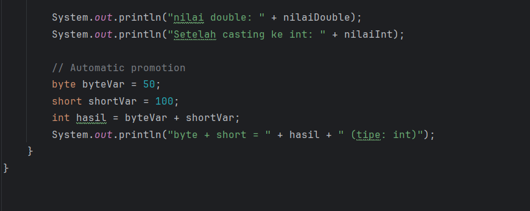
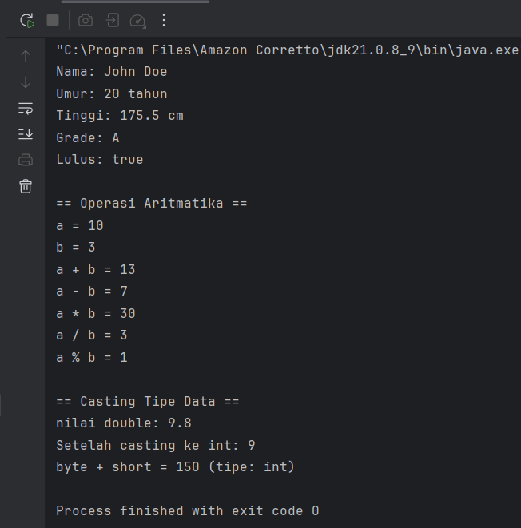
#### Analisa dan Pembahasan
Analisis file VariabelDemo.java di atas dapat dibagi menjadi beberapa bagian utama untuk memahami konsep dasar variabel dalam pemrograman Java
### Praktikum 2 - input, Output dan Scanner
#### Dasar Teori
Untuk membaca input dari pengguna dalam Java, kita menggunakan class Scanner yang terdapat dalam package java.util. Scanner menyediakan berbagai method untuk membaca berbagai tipe data:

+ nextInt(): membaca integer
+ nextDouble(): membaca double
+ nextLine(): membaca String (termasuk spasi)
+ next(): membaca String (sampai spasi pertama)
+ nextBoolean(): membaca boolean
#### Langkah Praktikum
Langkah 1: Import dan Membuat Scanner

Buat file baru dengan nama InputOutputDemo.java
Ketik kode berikut:
``` java
import java.util.Scanner;

public class InputOutputDemo {
    public static void main(String[] args) {
        // Membuat objek Scanner
        Scanner input = new Scanner(System.in);

        // Membaca input string
        System.out.print("Masukkan nama Anda: ");
        String nama = input.nextLine();

        // Membaca input integer
        System.out.print("Masukkan umur Anda: ");
        int umur = input.nextInt();

        // Membaca input double
        System.out.print("Masukkan tinggi Anda (cm): ");
        double tinggi = input.nextDouble();

        // Menampilkan output
        System.out.println("\n== DATA ANDA ==");
        System.out.println("Nama: " + nama);
        System.out.println("Umur: " + umur + " tahun");
        System.out.println("Tinggi: " + tinggi + " cm");

        // Menutup Scanner
        input.close();
    }
}
```
#### Screenshoot Hasil
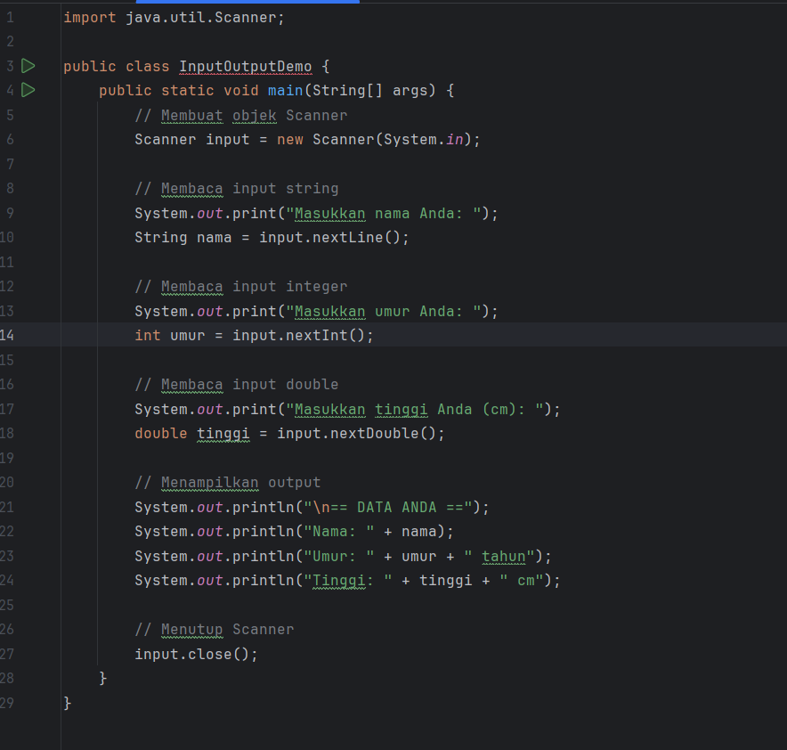

#### Analisa dan Pembahasan
Program InputOutputDemo.java adalah contoh program interaktif yang menunjukkan alur dasar:
Input: Program meminta data dari pengguna (nama dan umur) melalui ketikan keyboard.
Proses: Program menggunakan data tersebut untuk melakukan perhitungan sederhana (mencari tahun lahir).
Output: Program menampilkan kembali hasil olahan data ke layar pengguna sebagai informasi yang lengkap dan mudah dibaca.


---
### Praktikum 3 - Struktur Control: Percabangan
#### Dasar Teori
Struktur kontrol percabangan digunakan untuk membuat keputusan dalam program. Java menyediakan beberapa statement percabangan:

+if statement

if (kondisi) {
// kode yang dijalankan jika kondisi true
}

+ if-else Statement

if (kondisi) {
// kode jika kondisi true
} else {
// kode jika kondisi false
}
+ f-Else If-Else Statement

  if (kondisi1) {
  // kode jika kondisi1 true
  } else if (kondisi2) {
  // kode jika kondisi2 true
  } else {
  // kode jika semua kondisi false
  }


+ Switch Statement

switch (variabel) {
case nilai1:
// kode
break;
case nilai2:
// kode
break;
default:
// kode default
}

#### langkah praktikum
Langkah 1: Program Penentu Grade

Buat file baru dengan nama GradeDemo.java
Implementasikan kode berikut:
``` java
import java.util.Scanner;

public class GradeDemo {
    public static void main(String[] args) {
        Scanner input = new Scanner(System.in);
        System.out.print("Masukkan nilai (0-100): ");
        int nilai = input.nextInt();

        char grade;
        String keterangan;

        // Menggunakan if-else if-else
        if (nilai >= 85) {
            grade = 'A';
            keterangan = "Excellent";
        } else if (nilai >= 75) {
            grade = 'B';
            keterangan = "Good";
        } else if (nilai >= 65) {
            grade = 'C';
            keterangan = "Fair";
        } else if (nilai >= 55) {
            grade = 'D';
            keterangan = "Poor";
        } else {
            grade = 'E';
            keterangan = "Fail";
        }

        System.out.println("Nilai: " + nilai);
        System.out.println("Grade: " + grade);
        System.out.println("Keterangan: " + keterangan);

        input.close();
    }
}
```
#### screnshoot hasil
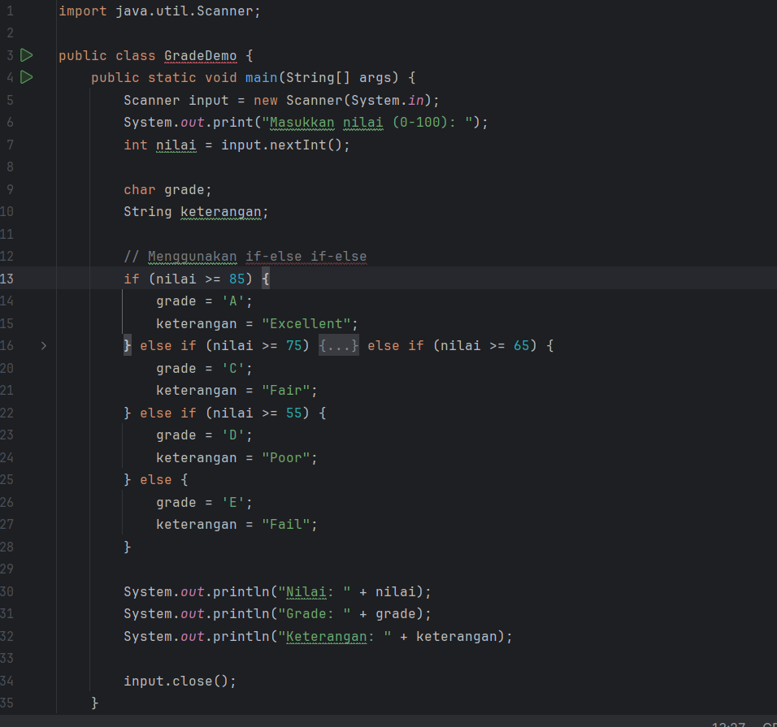
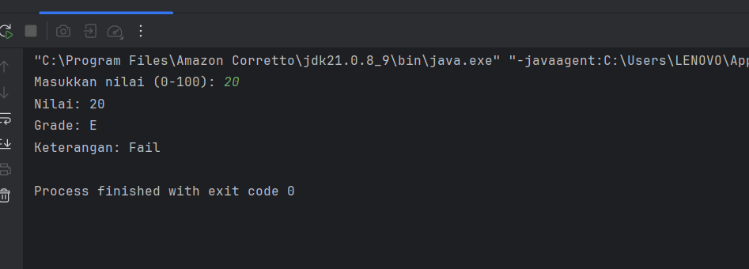

Langkah 2: Program Menu dengan Switch

Buat file baru dengan nama MenuDemo.java
Implementasikan kode berikut:
``` java
import java.util.Scanner;

public class MenuDemo {
    public static void main(String[] args) {
        Scanner input = new Scanner(System.in);

        System.out.println("=== MENU PILIHAN ===");
        System.out.println("1. Hitung Luas Persegi");
        System.out.println("2. Hitung Luas Lingkaran");
        System.out.println("3. Hitung Luas Segitiga");
        System.out.println("4. Keluar");

        System.out.print("Pilih menu (1-4): ");
        int pilihan = input.nextInt();

        switch(pilihan) {
            case 1:
                System.out.print("Masukkan sisi persegi: ");
                double sisi = input.nextDouble();
                double luasPersegi = sisi * sisi;
                System.out.println("Luas persegi: " + luasPersegi);
                break;

            case 2:
                System.out.print("Masukkan jari-jari lingkaran: ");
                double jariJari = input.nextDouble();
                double luasLingkaran = Math.PI * jariJari * jariJari;
                System.out.println("Luas lingkaran: " + luasLingkaran);
                break;

            case 3:
                System.out.print("Masukkan alas segitiga: ");
                double alas = input.nextDouble();
                System.out.print("Masukkan tinggi segitiga: ");
                double tinggi = input.nextDouble();
                double luasSegitiga = 0.5 * alas * tinggi;
                System.out.println("Luas segitiga: " + luasSegitiga);
                break;

            case 4:
                System.out.println("Terima kasih!");
                break;

            default:
                System.out.println("Pilihan tidak valid!");
        }

        input.close();
    }
}
``` 

#### screnshoot hasil
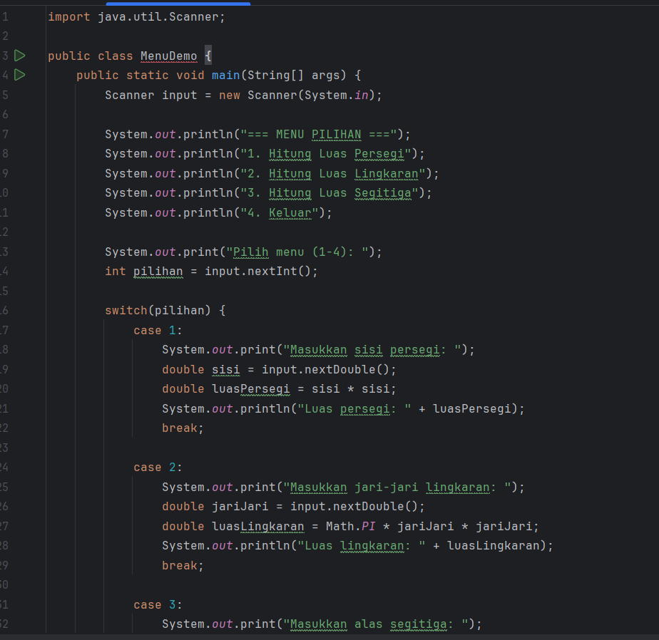
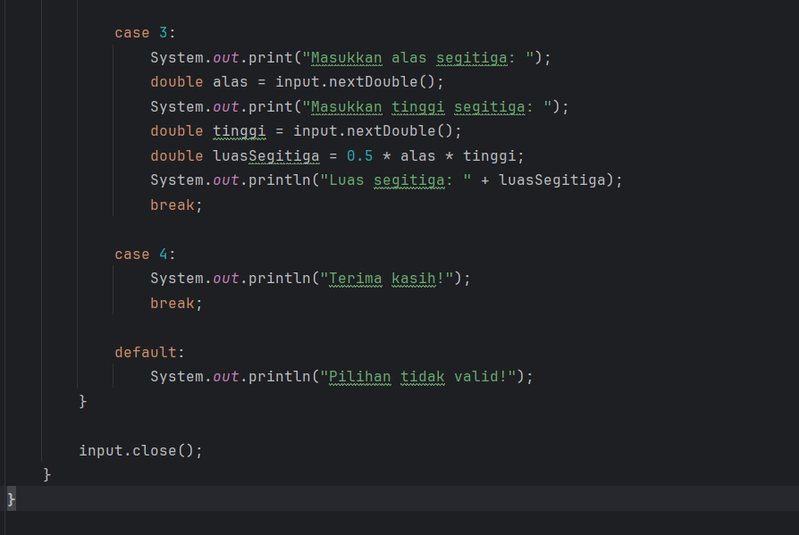


Langkah 3: Program Nested If

Buat file baru dengan nama NestedIfDemo.java
Implementasikan program untuk menentukan kategori usia:
``` java
import java.util.Scanner;

public class NestedIfDemo {
    public static void main(String[] args) {
        Scanner input = new Scanner(System.in);

        System.out.print("Masukkan umur: ");
        int umur = input.nextInt();

        if (umur > 0) {
            if (umur <= 2) {
                System.out.println("Kategori: Bayi");
            } else if (umur <= 5) {
                System.out.println("Kategori: Balita");
            } else if (umur <= 12) {
                System.out.println("Kategori: Anak-anak");
            } else if (umur <= 19) {
                System.out.println("Kategori: Remaja");
            } else if (umur <= 59) {
                System.out.println("Kategori: Dewasa");
            } else {
                System.out.println("Kategori: Lansia");
            }
        } else {
            System.out.println("Umur tidak valid!");
        }

        input.close();
    }
}
```
#### screnshoot hasil 
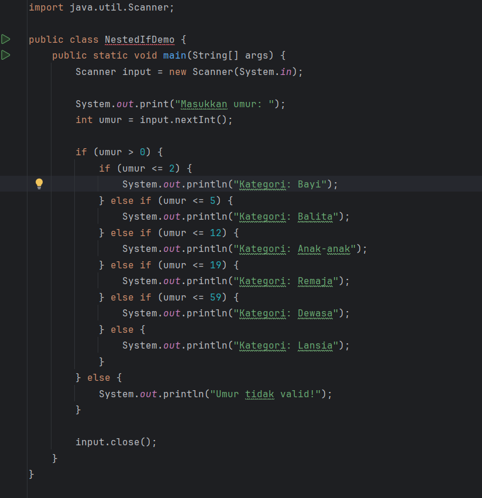
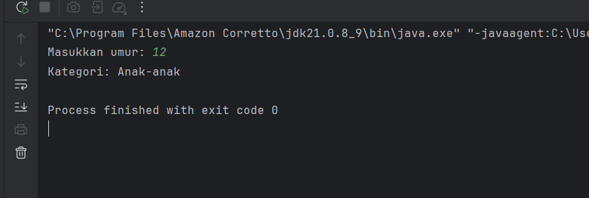

#### Analisa dan Pembahasan
+ Program GradeDemo.java adalah contoh program sederhana yang berfungsi untuk mengonversi nilai angka menjadi nilai huruf (misalnya, 90 menjadi 'A').


+ Program MenuDemo.java adalah contoh program yang mensimulasikan tampilan menu interaktif, seperti pada mesin ATM atau aplikasi konsol, di mana pengguna dapat memilih dari beberapa opsi yang tersedia.


+ Program NestedIfDemo.java adalah contoh kode yang mendemonstrasikan penggunaan percabangan bersarang (nested if), yaitu sebuah struktur di mana ada pernyataan if di dalam pernyataan if lainnya.

## Praktikum 4 - Struktur Control: Perulangan
#### Dasar Teori
Perulangan (loop) digunakan untuk mengulang eksekusi kode tertentu. Java menyediakan tiga jenis perulangan:

+ For Loop

for (inisialisasi; kondisi; increment/decrement) {
// kode yang diulang
}
While Loop
while (kondisi) {
// kode yang diulang
}

+ Do-While Loop

do {
// kode yang diulang

} while (kondisi);

#### langkah praktikum
Langkah 1: Perulangan For

Buat file baru dengan nama ForLoopDemo.java
Implementasikan berbagai contoh for loop:
``` java
public class ForLoopDemo {
    public static void main(String[] args) {
        // Contoh 1: Menampilkan angka 1-10
        System.out.println("== Angka 1-10 ==");
        for (int i = 1; i <= 10; i++) {
            System.out.print(i + " ");
        }
        System.out.println();

        // Contoh 2: Menampilkan angka genap
        System.out.println("\n== Angka Genap 2-20 ==");
        for (int i = 2; i <= 20; i += 2) {
            System.out.print(i + " ");
        }
        System.out.println();

        // Contoh 3: Countdown
        System.out.println("\n== Countdown ==");
        for (int i = 10; i >= 1; i--) {
            System.out.print(i + " ");
        }
        System.out.println("Start!");

        // Contoh 4: Tabel perkalian
        System.out.println("\n== Tabel Perkalian 5 ==");
        for (int i = 1; i <= 10; i++) {
            System.out.println("5 x " + i + " = " + (5 * i));
        }
    }
}
``` 

#### Screnshoot hasil forloop demo java
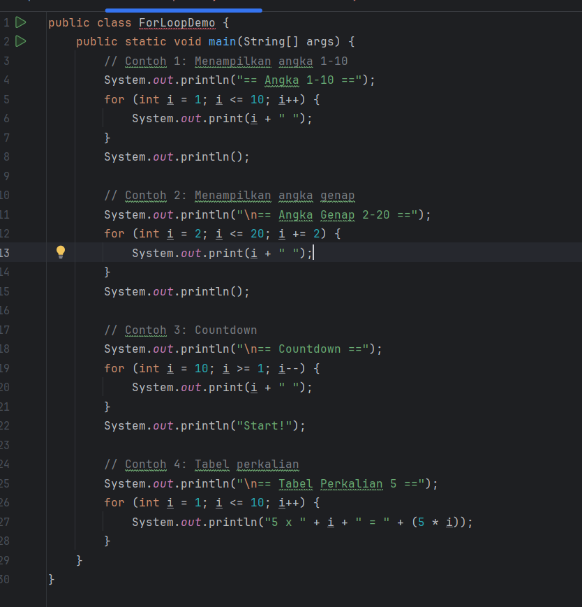
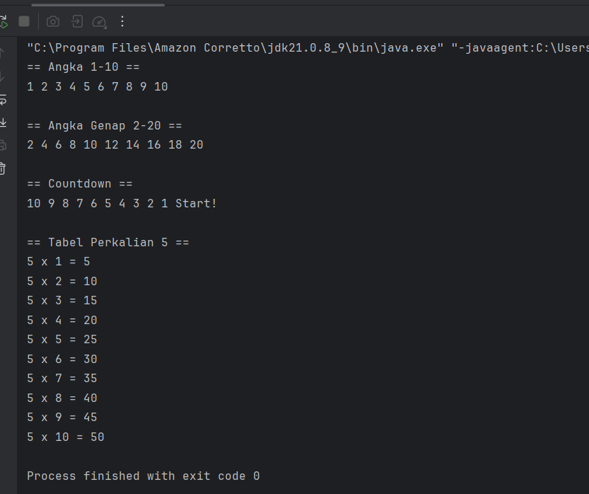
#### langkah praktikum 
Langkah 2: Perulangan While dan Do-While

Buat file baru dengan nama WhileLoopDemo.java
Implementasikan contoh while dan do-while:
``` java
import java.util.Scanner;

public class WhileLoopDemo {
    public static void main(String[] args) {
        Scanner input = new Scanner(System.in);

        // Contoh While Loop
        System.out.println("== While Loop - Tebak Angka ==");
        int tebakan = 0;
        int angkaRahasia = 7;

        while (tebakan != angkaRahasia) {
            System.out.print("Tebak angka (1-10): ");
            tebakan = input.nextInt();

            if (tebakan < angkaRahasia) {
                System.out.println("Terlalu kecil!");
            } else if (tebakan > angkaRahasia) {
                System.out.println("Terlalu besar!");
            } else {
                System.out.println("Benar! Angka rahasianya adalah " + angkaRahasia);
            }
        }

        // Contoh Do-While Loop
        System.out.println("\n== Do-While Loop - Menu ==");
        int pilihan;

        do {
            System.out.println("\n1. Tampilkan pesan");
            System.out.println("2. Hitung faktorial");
            System.out.println("3. Keluar");
            System.out.print("Pilih menu: ");
            pilihan = input.nextInt();

            switch(pilihan) {
                case 1:
                    System.out.println("Hello, World!");
                    break;
                case 2:
                    System.out.print("Masukkan angka: ");
                    int n = input.nextInt();
                    long faktorial = 1;
                    for (int i = 1; i <= n; i++) {
                        faktorial *= i;
                    }
                    System.out.println("Faktorial " + n + " = " + faktorial);
                    break;
                case 3:
                    System.out.println("Terima kasih!");
                    break;
                default:
                    System.out.println("Pilihan tidak valid!");
            }
        } while (pilihan != 3);

        input.close();
    }
}
``` 
#### screnshoot hasil whileloop demo java
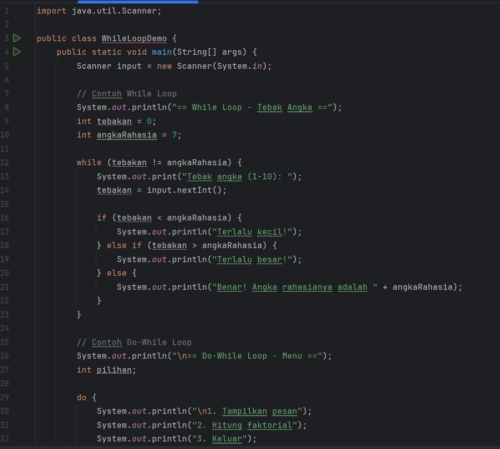
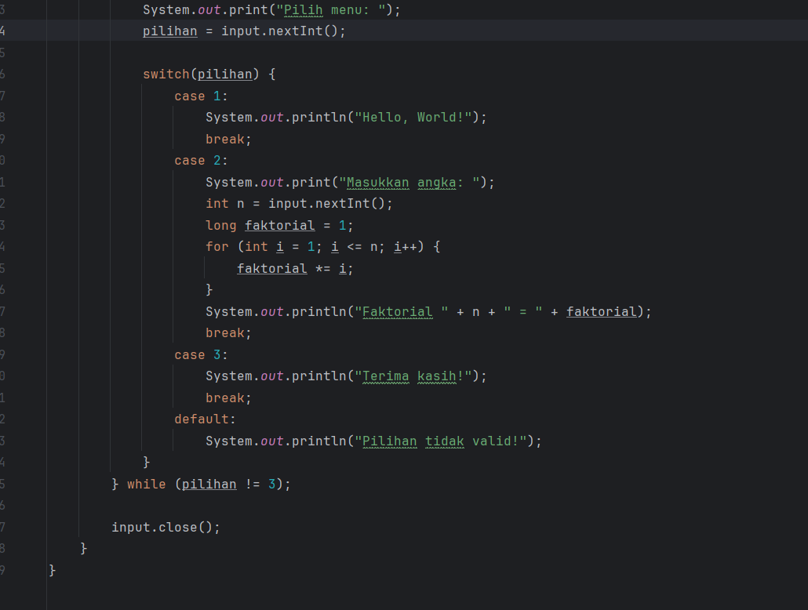
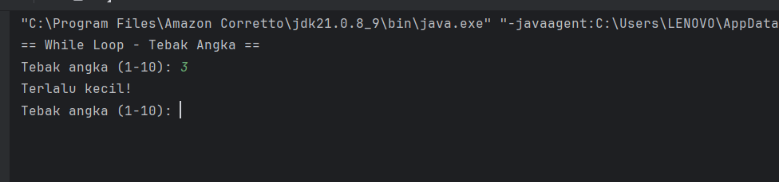

Langkah 3: Nested Loop (Perulangan Bersarang)

Buat file baru dengan nama NestedLoopDemo.java
Implementasikan contoh nested loop:

``` java
public class NestedLoopDemo {
    public static void main(String[] args) {
        // Contoh 1: Pola Bintang
        System.out.println("== Pola Bintang Segitiga ==");
        for (int i = 1; i <= 5; i++) {
            for (int j = 1; j <= i; j++) {
                System.out.print("* ");
            }
            System.out.println();
        }

        // Contoh 2: Tabel Perkalian
        System.out.println("\n== Tabel Perkalian 1-5 ==");
        for (int i = 1; i <= 5; i++) {
            for (int j = 1; j <= 5; j++) {
                System.out.printf("%3d ", (i * j));
            }
            System.out.println();
        }

        // Contoh 3: Pola Angka
        System.out.println("\n== Pola Angka ==");
        for (int i = 1; i <= 4; i++) {
            for (int j = 1; j <= i; j++) {
                System.out.print(j + " ");
            }
            System.out.println();
        }
    }
}
```

#### screnshoot hasil nestedlooop demo 
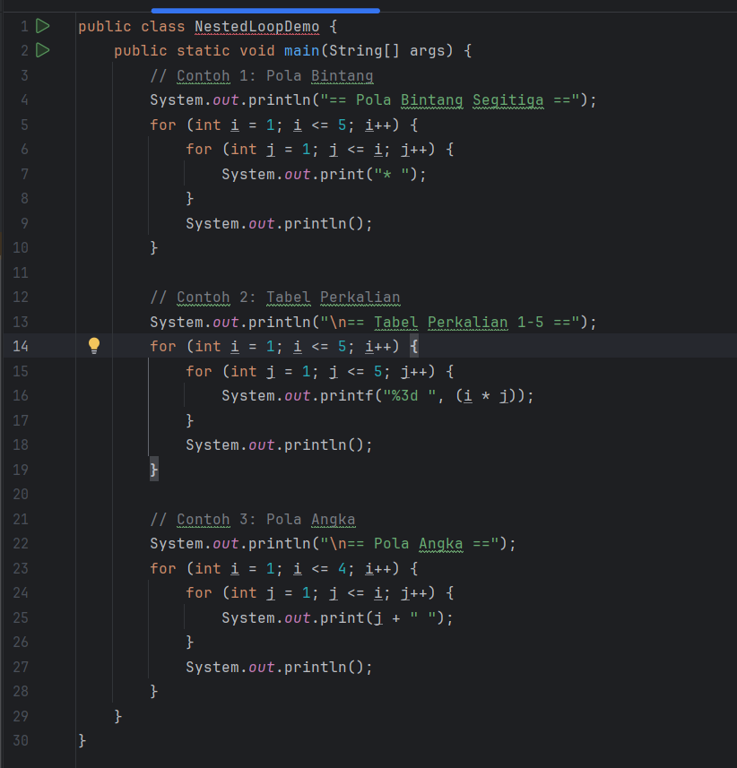
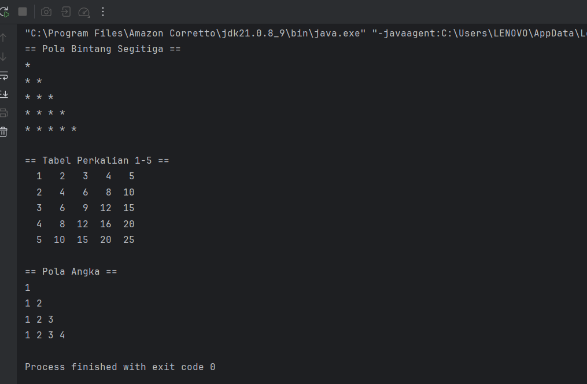
#### Analisa dan pembahasan
+ For loop sangat ideal untuk perulangan yang jumlahnya pasti, seperti mengulang proses sebanyak N kali, atau mengakses setiap elemen dalam sebuah array.

+ While loop sangat cocok untuk perulangan yang jumlahnya tidak pasti dan bergantung pada terpenuhinya sebuah syarat atau kondisi dinamis.

+ Nested loop digunakan untuk memproses data yang memiliki struktur baris dan kolom atau untuk menyelesaikan masalah yang memerlukan iterasi bertingkat.

## 3. Kesimpulan

Praktikum ini memberikan pemahaman mendasar tentang blok-blok bangunan utama (fundamental building blocks) dalam pemrograman menggunakan bahasa Java. Dari serangkaian demo yang telah dibahas, dapat disimpulkan beberapa poin kunci:

Penyimpanan Data (Variabel): Dasar dari semua program adalah kemampuan untuk menyimpan dan mengelola data. Kita belajar bahwa setiap data memiliki tipe (seperti int untuk angka, String untuk teks, boolean untuk logika) yang disimpan dalam variabel.
Interaksi dengan Pengguna (Input/Output): Program tidak hanya berjalan sendiri, tetapi juga dapat berinteraksi. Dengan Scanner (input) dan System.out.println() (output), kita bisa membuat program yang dinamis, yang mampu menerima masukan dari pengguna dan memberikan hasil kembali.
Pengambilan Keputusan (Logika Percabangan): Program dapat berpikir dan membuat keputusan. Melalui if-else (GradeDemo) dan if bersarang (NestedIfDemo), kita belajar cara mengontrol alur program agar dapat menjalankan aksi yang berbeda-beda tergantung pada kondisi yang terpenuhi.

---

## 5. Referensi
W3Schools Java Tutorial — https://www.w3schools.com/java/

Oracle, The Java™ Tutorials: Language Basics — https://docs.oracle.com/javase/tutorial/java/nutsandbolts/index.html

---
