# Laporan Modul 3: Dasar Pemrograman Java Lanjutan
**Mata Kuliah:** Praktikum Pemrograman Berorientasi Objek   
**Nama:** zamharira  
**NIM:** 2024573010051
**Kelas:** Ti 2E

---

## 1. Abstrak
Modul ini dirancang untuk memberikan pemahaman dasar tentang pemrograman Java melalui praktikum langsung. Setiap praktikum dilengkapi dengan teori dasar dan langkah-langkah implementasi yang detail..
#### Teori Dasar

Array adalah struktur data yang dapat menyimpan beberapa nilai dengan tipe data yang sama dalam satu variabel. Array menggunakan indeks untuk mengakses elemen-elemennya, dimulai dari indeks 0.

Karakteristik Array:
Semua elemen memiliki tipe data yang sama
Ukuran array bersifat tetap (fixed size)
Indeks dimulai dari 0
Elemen dapat diakses secara langsung menggunakan indeks

+ Syntax Array:

+ // Deklarasi array
  tipeData[] namaArray = new tipeData[ukuran];

+ // Atau inisialisasi langsung
tipeData[] namaArray = {nilai1, nilai2, nilai3, ...};
---
## 2. Praktikum
### Praktikum 1.1 - Array Satu Dimensi

``` java
public class ArraySatuDimensi {
    public static void main(String[] args) {

        // Langkah 1: Deklarasi dan inisialisasi array
        int[] nilai = {85, 90, 78, 92, 88};
        String[] nama = {"Alice", "Bob", "Charlie", "Diana", "Eva"};

        // Langkah 2: Menampilkan panjang array
        // There's a small correction here from the image to correctly display the array length.
        System.out.println("Jumlah siswa: " + nilai.length);

        // Langkah 3: Mengakses elemen array
        System.out.println("Nama siswa pertama: " + nama[0]);
        System.out.println("Nilai siswa pertama: " + nilai[0]);

        // Langkah 4: Menampilkan semua data menggunakan loop
        System.out.println("\nData semua siswa:");
        for (int i = 0; i < nama.length; i++) {
            System.out.println((i + 1) + ". " + nama[i] + " - Nilai: " + nilai[i]);
        }
    }
}
```

#### Output program 

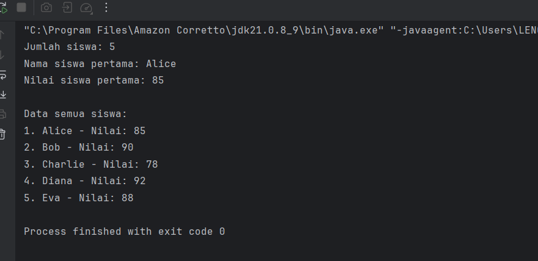

#### Modifikasi program diatas untuk menambahkan fitur pencarian nilai tertinggi dan terendah
``` java
public class ArraySatuDimensi {
    public static void main(String[] args) {

        // Langkah 1: Deklarasi dan inisialisasi array
        int[] nilai = {85, 90, 78, 92, 88};
        String[] nama = {"Alice", "Bob", "Charlie", "Diana", "Eva"};

        // Langkah 2: Menampilkan panjang array
        System.out.println("Jumlah siswa: " + nilai.length);

        // Langkah 3: Mengakses elemen array
        System.out.println("Nama siswa pertama: " + nama[0]);
        System.out.println("Nilai siswa pertama: " + nilai[0]);

        // Langkah 4: Menampilkan semua data menggunakan loop
        System.out.println("\nData semua siswa:");
        for (int i = 0; i < nama.length; i++) {
            System.out.println((i + 1) + ". " + nama[i] + " - Nilai: " + nilai[i]);
        }

        // Langkah 5: MODIFIKASI - Mencari nilai tertinggi dan terendah
        // Inisialisasi variabel tertinggi dan terendah dengan nilai elemen pertama
        int nilaiTertinggi = nilai[0];
        int nilaiTerendah = nilai[0];

        // Loop untuk membandingkan setiap nilai dalam array
        for (int i = 1; i < nilai.length; i++) {
            // Jika nilai saat ini lebih besar dari nilaiTertinggi, update nilaiTertinggi
            if (nilai[i] > nilaiTertinggi) {
                nilaiTertinggi = nilai[i];
            }
            // Jika nilai saat ini lebih kecil dari nilaiTerendah, update nilaiTerendah
            if (nilai[i] < nilaiTerendah) {
                nilaiTerendah = nilai[i];
            }
        }

        // Menampilkan hasil nilai tertinggi dan terendah
        System.out.println("\n--- Analisis Nilai ---");
        System.out.println("Nilai Tertinggi: " + nilaiTertinggi);
        System.out.println("Nilai Terendah: " + nilaiTerendah);
    }
}

```
+ Output program setelah di modifikasi

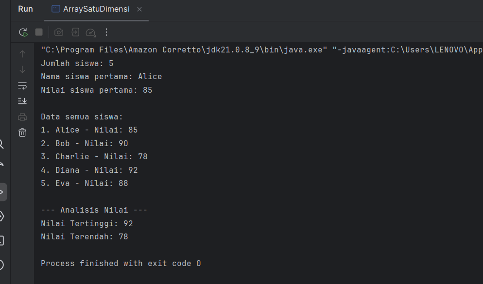

#### Tugas Praktikum 1.1  
+ Buat array untuk menyimpan nilai ujian 10 siswa,
+ kemudian, hitung dan tampilkan rata-rata nilai,
+ kemudian, cari dan tampilkan nilai tertinggi dan terendah.

### jawaban praktikum 1.1 
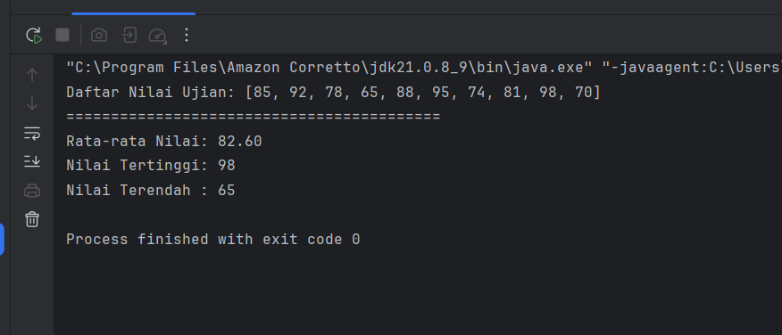

#### Praktikum 1.2: Array Dua Dimensi
Memahami konsep dan penggunaan array dua dimensi (matriks).
#### Langkah Praktikum
+ Buat file baru dengan nama ArrayDuaDimensi.java
+ Implementasikan kode berikut:

``` java
import java.util.Scanner;

public class ArrayDuaDimensi {
    public static void main(String[] args) {
        Scanner input = new Scanner(System.in);

        // Langkah 1: Deklarasi array 2D untuk nilai siswa (3 siswa, 4 mata pelajaran)
        int[][] nilaiSiswa = new int[3][4];
        String[] namaSiswa = {"Alice", "Bob", "Charlie"};
        String[] mataPelajaran = {"Matematika", "Bahasa Indonesia", "IPA", "IPS"};

        // Langkah 2: Input nilai
        System.out.println("=== INPUT NILAI SISWA ===");
        for (int i = 0; i < 3; i++) {
            System.out.println("Input nilai untuk " + namaSiswa[i] + ":");
            for (int j = 0; j < 4; j++) {
                System.out.print(mataPelajaran[j] + ": ");
                nilaiSiswa[i][j] = input.nextInt();
            }
            System.out.println();
        }

        // Langkah 3: Menampilkan data dalam bentuk tabel
        System.out.println("\n=== TABEL NILAI SISWA ===");
        System.out.printf("%-12s", "Nama");
        for (String mapel : mataPelajaran) {
            // Memotong nama mapel jika terlalu panjang agar tabel rapi
            System.out.printf("%-8s", mapel.substring(0, Math.min(7, mapel.length())));
        }
        System.out.println("Rata-rata");

        for (int i = 0; i < 3; i++) {
            System.out.printf("%-12s", namaSiswa[i]);
            int total = 0;
            for (int j = 0; j < 4; j++) {
                System.out.printf("%-8d", nilaiSiswa[i][j]);
                // KESALAHAN: Baris ini seharusnya menjumlahkan (total += ...), bukan menimpa nilai total
                total = nilaiSiswa[i][j]; 
            }
            double rataRata = total / 4.0;
            System.out.printf("%.2f\n", rataRata);
        }
    }
}
``` 
#### output program ArrayDuaDimensi
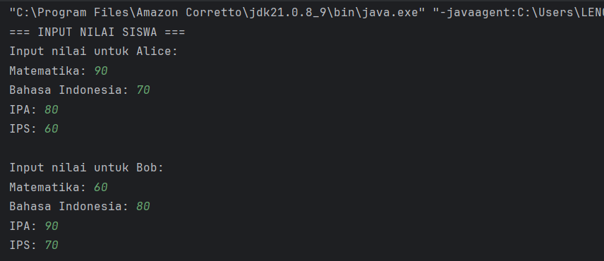
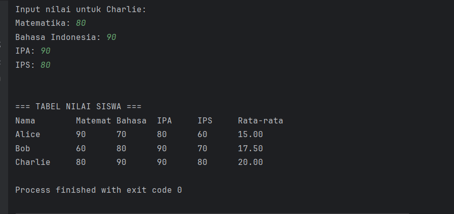
#### Analisa struktur array yang telah dibuat
1. Struktur dan Dimensi Array

+ Berdasarkan tabel output, kita bisa menyimpulkan dengan pasti bahwa program menggunakan array 2D dengan struktur sebagai berikut:
+ Jumlah Baris: 3
Ada tiga entitas siswa yang ditampilkan (Alice, Bob, Charlie). Ini berarti array 2D memiliki 3 baris, di mana setiap baris mewakili data untuk satu siswa.
+ Jumlah Kolom: 4
Untuk setiap siswa, ada empat nilai yang tercatat (Matematika, Bahasa, IPA, IPS). Ini berarti array 2D memiliki 4 kolom, di mana setiap kolom mewakili nilai untuk satu mata pelajaran.
Jadi, array yang digunakan adalah array int[3][4].

### Tugas praktikum 1.2 
Buatkan sebuah class baru dengan nama latihan2.java di dalam package latihan. Selesaikan tugas berikut:


Dari kode praktikum diatas.
- Tambahkan fitur untuk menampilkan mata pelajaran dengan nilai tertinggi untuk setiap siswa
- Hitung rata-rata nilai untuk setiap mata pelajaran
#### Jawaban praktikum 1.2 
``` java
import java.util.Scanner;
import java.util.Arrays;

public class latihan2 {
    public static void main(String[] args) {
        Scanner input = new Scanner(System.in);

        // Langkah 1: Deklarasi array
        String[] namaSiswa = {"Alice", "Bob", "Charlie"};
        String[] mataPelajaran = {"Matematika", "Bahasa Ind", "IPA", "IPS"};
        int[][] nilaiSiswa = new int[namaSiswa.length][mataPelajaran.length];

        // Langkah 2: Input nilai
        System.out.println("=== INPUT NILAI SISWA ===");
        for (int i = 0; i < namaSiswa.length; i++) {
            System.out.println("Input nilai untuk " + namaSiswa[i] + ":");
            for (int j = 0; j < mataPelajaran.length; j++) {
                System.out.print(mataPelajaran[j] + ": ");
                nilaiSiswa[i][j] = input.nextInt();
            }
            System.out.println();
        }

        // Langkah 3: Menampilkan data, menghitung rata-rata per siswa, dan mencari nilai tertinggi per siswa
        System.out.println("\n=== TABEL NILAI SISWA ===");
        
        // Header Tabel
        System.out.printf("%-12s", "Nama");
        for (String mapel : mataPelajaran) {
            System.out.printf("%-12s", mapel);
        }
        System.out.println("Rata-rata");

        // Array untuk menyimpan info nilai tertinggi setiap siswa
        String[] infoNilaiTertinggi = new String[namaSiswa.length];

        // Isi Tabel
        for (int i = 0; i < namaSiswa.length; i++) {
            System.out.printf("%-12s", namaSiswa[i]);
            
            int total = 0;
            int nilaiTertinggiSiswa = nilaiSiswa[i][0]; // Asumsikan nilai pertama tertinggi
            String mapelTertinggi = mataPelajaran[0];   // Asumsikan mapel pertama tertinggi

            for (int j = 0; j < mataPelajaran.length; j++) {
                System.out.printf("%-12d", nilaiSiswa[i][j]);
                
                // [PERBAIKAN] Menggunakan += untuk menjumlahkan nilai
                total += nilaiSiswa[i][j];

                // [FITUR 1] Mencari nilai dan mapel tertinggi untuk siswa ini
                if (nilaiSiswa[i][j] > nilaiTertinggiSiswa) {
                    nilaiTertinggiSiswa = nilaiSiswa[i][j];
                    mapelTertinggi = mataPelajaran[j];
                }
            }
            
            double rataRata = (double) total / mataPelajaran.length;
            System.out.printf("%.2f\n", rataRata);

            // Menyimpan hasil fitur 1 ke dalam array
            infoNilaiTertinggi[i] = String.format("Nilai tertinggi %s: %d (pada mata pelajaran %s)", namaSiswa[i], nilaiTertinggiSiswa, mapelTertinggi);
        }

        // Menampilkan hasil Fitur 1
        System.out.println("\n--- NILAI TERTINGGI PER SISWA ---");
        for (String info : infoNilaiTertinggi) {
            System.out.println(info);
        }
        
        // [FITUR 2] Menghitung dan menampilkan rata-rata nilai untuk setiap mata pelajaran
        System.out.println("\n--- RATA-RATA NILAI PER MATA PELAJARAN ---");
        for (int j = 0; j < mataPelajaran.length; j++) { // Loop luar iterasi per MATA PELAJARAN (kolom)
            double totalPerMapel = 0;
            for (int i = 0; i < namaSiswa.length; i++) { // Loop dalam iterasi per SISWA (baris)
                totalPerMapel += nilaiSiswa[i][j];
            }
            double rataRataMapel = totalPerMapel / namaSiswa.length;
            System.out.printf("%-12s: %.2f\n", mataPelajaran[j], rataRataMapel);
        }
    }
}
```
outputnya 
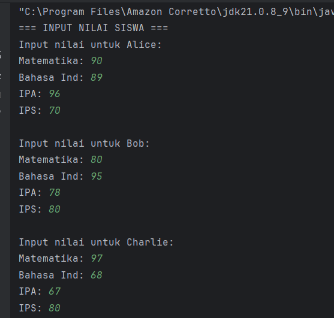
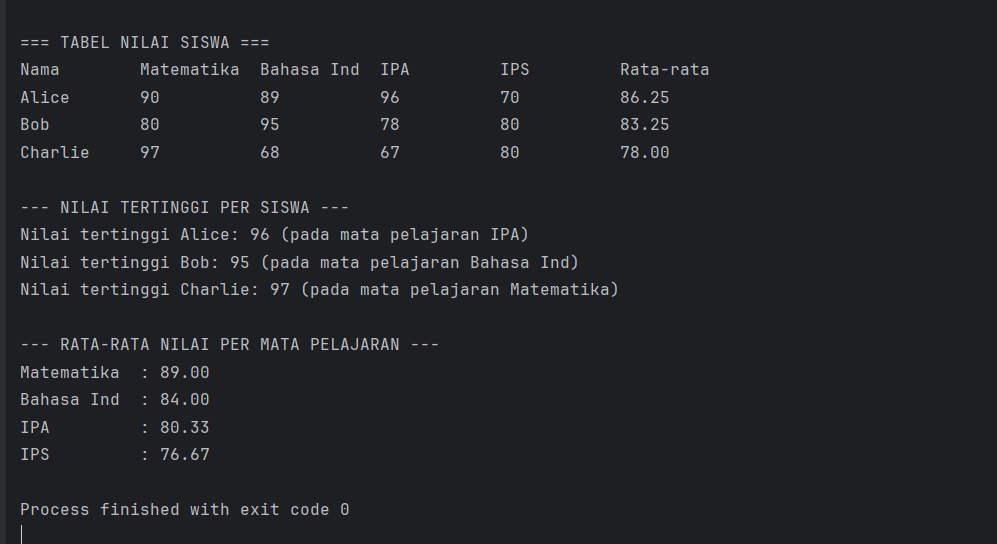

### method/function
#### Teori Dasar
Method adalah blok kode yang dapat dipanggil untuk menjalankan tugas tertentu. Method memungkinkan kita untuk:

Menghindari pengulangan kode
Membuat program lebih terstruktur
Memudahkan debugging dan maintenance
#### Jenis Method:

Static Method: Dapat dipanggil tanpa membuat object
Non-static Method: Perlu membuat object terlebih dahulu
Void Method: Tidak mengembalikan nilai
Return Method: Mengembalikan nilai

##### Syntax Method:

+ java[access modifier] [static] returnType namaMethod(parameter) {
// body method
return value; // jika ada return type
}
#### Praktikum 2.1: Method Dasar
Memahami cara membuat dan memanggil method dengan berbagai jenis parameter dan return type.

+ Buat file baru dengan nama MethodDasar.java
+ Ketik kode berikut:
``` java
public class MethodDasar {

    // Langkah 1: Method void tanpa parameter
    // Method ini hanya bertugas menampilkan header, tidak mengembalikan nilai.
    public static void tampilkanHeader() {
        System.out.println("========================================");
        System.out.println("======= PROGRAM KALKULATOR SEDERHANA =======");
        System.out.println("========================================");
    }

    // Langkah 2: Method void dengan parameter
    // Method ini menerima input (operasi, angka, dan hasil) untuk ditampilkan.
    public static void tampilkanHasil(String operasi, double a, double b, double hasil) {
        System.out.printf("%.2f %s %.2f = %.2f\n", a, operasi, b, hasil);
    }

    // Langkah 3: Method dengan return value
    // Method-method ini melakukan perhitungan dan mengembalikan hasilnya (return).
    public static double tambah(double a, double b) {
        return a + b;
    }

    public static double kurang(double a, double b) {
        return a - b;
    }

    public static double kali(double a, double b) {
        return a * b;
    }

    public static double bagi(double a, double b) {
        // Validasi agar tidak terjadi pembagian dengan nol
        if (b != 0) {
            return a / b;
        } else {
            System.out.println("Error: Pembagian dengan nol!");
            return 0; // Mengembalikan 0 jika terjadi error
        }
    }

    // Langkah 4: Method dengan validasi input
    // Method ini memeriksa apakah sebuah angka valid (bukan NaN atau Infinity).
    public static boolean validasiAngka(double angka) {
        return !Double.isNaN(angka) && Double.isFinite(angka);
    }

    // Langkah 5: Menggunakan semua method di main()
    public static void main(String[] args) {
        // Memanggil method untuk menampilkan header
        tampilkanHeader();

        double x = 15.5;
        double y = 4.2;

        // Memanggil method validasi sebelum melakukan perhitungan
        if (validasiAngka(x) && validasiAngka(y)) {
            // Memanggil method-method perhitungan
            double hasilTambah = tambah(x, y);
            double hasilKurang = kurang(x, y);
            double hasilKali = kali(x, y);
            double hasilBagi = bagi(x, y);

            // Memanggil method untuk menampilkan setiap hasil
            tampilkanHasil("+", x, y, hasilTambah);
            tampilkanHasil("-", x, y, hasilKurang);
            tampilkanHasil("*", x, y, hasilKali);
            tampilkanHasil("/", x, y, hasilBagi);
        }
    }
}
```
#### Analisis program yg telah dibuat
+ Cara Kerja Setiap Method 

Output yang Anda perlihatkan adalah hasil eksekusi program dengan nilai x = 15.5 dan y = 4.2. Berikut adalah rincian bagaimana setiap method bekerja untuk menghasilkan output tersebut:

+ main() Dimulai: Eksekusi program selalu dimulai dari method main.

+ tampilkanHeader() Dipanggil:

+ Perintah pertama di main adalah tampilkanHeader();.

+ Method ini tidak menerima parameter dan tidak mengembalikan nilai (void).

Tugasnya hanya satu: mencetak tiga baris header ke konsol. Ini menghasilkan bagian pertama dari output Anda:
validasiAngka() Dipanggil:


+ validasiAngka(15.5) dipanggil. Method ini mengembalikan true karena 15.5 adalah angka yang valid.
validasiAngka(4.2) dipanggil. Method ini juga mengembalikan true.

Karena true && true hasilnya true, maka semua kode di dalam blok if akan dijalankan.

+ Method Perhitungan Dipanggil:

    double hasilTambah = tambah(x, y); → tambah(15.5, 4.2) dipanggil. Method ini mengembalikan 19.7.

    double hasilKurang = kurang(x, y); → kurang(15.5, 4.2) dipanggil. Method ini mengembalikan 11.3.

    double hasilKali = kali(x, y); → kali(15.5, 4.2) dipanggil. Method ini mengembalikan 65.1.

    double hasilBagi = bagi(x, y); → bagi(15.5, 4.2) dipanggil. Karena y bukan 0, method ini mengembalikan 3.69047....


+ tampilkanHasil() Dipanggil Berulang Kali:

    tampilkanHasil("+", x, y, hasilTambah); dipanggil. Method ini menerima empat parameter ("+", 15.5, 4.2, 19.7) dan menggunakan printf untuk memformatnya menjadi: 15.50 + 4.20 = 19.70.

Proses yang sama diulang untuk pengurangan, perkalian, dan pembagian, menghasilkan empat baris perhitungan pada output Anda.

#### ubah nilai x dan y yang berbeda
Sekarang, mari kita ubah nilai x dan y di dalam method main untuk menguji skenario lain, misalnya pembagian dengan nol.

Perubahan Kode (hanya di method main):
``` java
    public static void main(String[] args) {
        // Memanggil method untuk menampilkan header
        tampilkanHeader();

        // Mengubah nilai x dan y
        double x = 25.0;
        double y = 0.0; // Kita coba bagi dengan nol

        // Memanggil method validasi sebelum melakukan perhitungan
        if (validasiAngka(x) && validasiAngka(y)) {
            // ... sisa kode sama ...
            double hasilTambah = tambah(x, y);
            double hasilKurang = kurang(x, y);
            double hasilKali = kali(x, y);
            double hasilBagi = bagi(x, y);

            tampilkanHasil("+", x, y, hasilTambah);
            tampilkanHasil("-", x, y, hasilKurang);
            tampilkanHasil("*", x, y, hasilKali);
            tampilkanHasil("/", x, y, hasilBagi);
        }
    }
  ```
Hasil Output Baru:

Jika program dijalankan dengan nilai x = 25.0 dan y = 0.0, outputnya akan menjadi seperti ini:

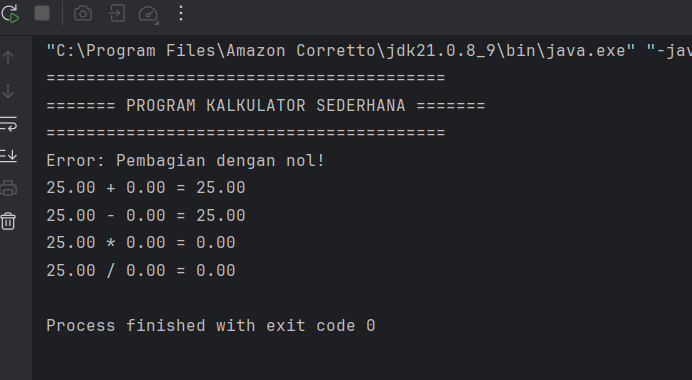
---
### Tugas praktikum 2.1
Buatkan sebuah class baru dengan nama latihan3.java di dalam package latihan. Selesaikan tugas berikut:
Dari kode praktikum diatas.
- Tambahkan method untuk operasi pangkat dan akar kuadrat
- Buat method untuk validasi operasi pembagian dengan nol

### Hasil praktikum 2.1 
``` java
public class latihan3 {

    // ... (method-method yang sudah ada) ...
    public static void tampilkanHeader() {
        System.out.println("========================================");
        System.out.println("======= PROGRAM KALKULATOR LANJUTAN =======");
        System.out.println("========================================");
    }

    public static void tampilkanHasil(String operasi, double a, double b, double hasil) {
        System.out.printf("%.2f %s %.2f = %.2f\n", a, operasi, b, hasil);
    }

    public static double tambah(double a, double b) {
        return a + b;
    }

    public static double kurang(double a, double b) {
        return a - b;
    }

    public static double kali(double a, double b) {
        return a * b;
    }

    // Method bagi disederhanakan, validasi dipindah ke method sendiri
    public static double bagi(double a, double b) {
        return a / b;
    }

    public static boolean validasiAngka(double angka) {
        return !Double.isNaN(angka) && Double.isFinite(angka);
    }

    // =======================================================
    // PENAMBAHAN DAN PERUBAHAN DI BAWAH INI
    // =======================================================

    /**
     * [BARU] Method untuk menghitung pangkat.
     * Menggunakan Math.pow() dari library Java.
     */
    public static double pangkat(double basis, double eksponen) {
        return Math.pow(basis, eksponen);
    }

    /**
     * [BARU] Method untuk menghitung akar kuadrat.
     * Menggunakan Math.sqrt() dan menambahkan validasi untuk angka negatif.
     */
    public static double akarKuadrat(double angka) {
        if (angka < 0) {
            System.out.println("Error: Akar kuadrat dari angka negatif tidak valid!");
            return 0;
        }
        return Math.sqrt(angka);
    }

    /**
     * [BARU] Method khusus untuk validasi pembagian dengan nol.
     * Mengembalikan boolean (true jika valid, false jika tidak).
     */
    public static boolean validasiPembagian(double pembagi) {
        if (pembagi == 0) {
            System.out.println("Error: Pembagian dengan nol tidak diizinkan!");
            return false;
        }
        return true;
    }


    public static void main(String[] args) {
        tampilkanHeader();

        // Menggunakan nilai baru untuk menunjukkan fitur pangkat dan akar
        double x = 9.0;
        double y = 2.0;
        
        System.out.println("\nOperasi untuk x = " + x + " dan y = " + y);

        if (validasiAngka(x) && validasiAngka(y)) {
            // Operasi dasar
            tampilkanHasil("+", x, y, tambah(x, y));
            tampilkanHasil("-", x, y, kurang(x, y));
            tampilkanHasil("*", x, y, kali(x, y));
            
            // [REFACTOR] Panggil validasi sebelum melakukan pembagian
            if (validasiPembagian(y)) {
                double hasilBagi = bagi(x, y);
                tampilkanHasil("/", x, y, hasilBagi);
            }
            
            // [BARU] Panggil method pangkat
            double hasilPangkat = pangkat(x, y);
            tampilkanHasil("^", x, y, hasilPangkat);

            // [BARU] Panggil method akar kuadrat
            double hasilAkar = akarKuadrat(x);
            // Tampilkan hasil akar secara terpisah karena formatnya berbeda
            System.out.printf("Akar kuadrat dari %.2f = %.2f\n", x, hasilAkar);
        }
    }
}
``` 
### analisa perubahan dan penambahan program

+ Method pangkat(basis, eksponen)

    Method baru ini menerima dua parameter: angka dasar (basis) dan angka pangkat (eksponen).

    Ia menggunakan fungsi Math.pow() yang sudah disediakan oleh Java untuk melakukan perhitungan pangkat dan mengembalikan hasilnya.

+ Method akarKuadrat(angka)

    Method baru ini menerima satu parameter (angka).

    Sebelum menghitung, ia memeriksa apakah angka tersebut negatif. Jika ya, ia akan menampilkan pesan error karena akar kuadrat dari angka negatif bukanlah bilangan real.

    Jika angka valid, ia menggunakan Math.sqrt() untuk menghitung akar kuadrat dan mengembalikan hasilnya.

+ Refactoring Validasi Pembagian

    Method Baru validasiPembagian(pembagi): Dibuat method boolean khusus yang tugasnya hanya satu: memeriksa apakah angka pembagi adalah nol. Jika nol, ia menampilkan pesan error dan mengembalikan false. Jika tidak, ia mengembalikan true.

    Method bagi(a, b) Disederhanakan: Logika if-else untuk memeriksa pembagian dengan nol dihapus dari method bagi(). Sekarang tugasnya murni hanya menghitung a / b.

    Perubahan di main(): Pemanggilan method bagi() sekarang "dibungkus" di dalam sebuah if. Program akan memanggil validasiPembagian(y) terlebih dahulu. Hanya jika validasi tersebut mengembalikan true, maka bagi(x,y) akan dieksekusi. Ini adalah praktik yang baik karena memisahkan antara validasi dan eksekusi

### hasil output nya 
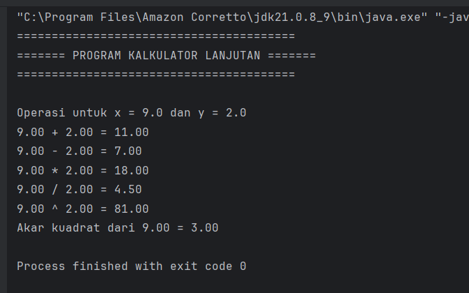
#### praktikum 2.2: Method dengan array
Buat file baru dengan nama ArrayMethod.java
lalu isi dengan kode berikut
``` java
import java.util.Scanner;

public class ArrayMethod {

    /**
     * Method untuk meminta input dari pengguna dan mengembalikan sebuah array integer.
     */
    public static int[] inputArray(int ukuran) {
        Scanner input = new Scanner(System.in);
        int[] array = new int[ukuran];
        
        System.out.println("Masukkan " + ukuran + " angka:");
        for (int i = 0; i < ukuran; i++) {
            System.out.print("Angka ke-" + (i + 1) + ": ");
            array[i] = input.nextInt();
        }
        return array;
    }

    /**
     * Method untuk menampilkan isi dari sebuah array integer.
     */
    public static void tampilkanArray(int[] array) {
        System.out.print("[");
        // Loop untuk mencetak semua elemen kecuali yang terakhir, dengan koma
        for (int i = 0; i < array.length - 1; i++) {
            System.out.print(array[i] + ", ");
        }
        // Cetak elemen terakhir tanpa koma
        if (array.length > 0) {
            System.out.print(array[array.length - 1]);
        }
        System.out.println("]");
    }

    /**
     * Method untuk mencari nilai maksimum dari sebuah array.
     */
    public static int cariMaksimum(int[] array) {
        int maks = array[0]; // Asumsikan elemen pertama adalah yang terbesar
        for (int i = 1; i < array.length; i++) {
            if (array[i] > maks) {
                maks = array[i];
            }
        }
        return maks;
    }

    /**
     * Method untuk mencari nilai minimum dari sebuah array.
     */
    public static int cariMinimum(int[] array) {
        int min = array[0]; // Asumsikan elemen pertama adalah yang terkecil
        for (int i = 1; i < array.length; i++) {
            if (array[i] < min) {
                min = array[i];
            }
        }
        return min;
    }

    /**
     * Method untuk menghitung rata-rata dari sebuah array.
     */
    public static double hitungRataRata(int[] array) {
        int total = 0;
        for (int nilai : array) {
            total += nilai;
        }
        // Cast ke double agar hasil pembagian tidak berupa integer
        return (double) total / array.length;
    }

    /**
     * Method untuk mengurutkan array menggunakan algoritma Bubble Sort.
     * Method ini membuat salinan array agar array asli tidak berubah.
     */
    public static int[] urutkanArray(int[] array) {
        int[] arrayBaru = array.clone(); // Membuat salinan array
        int n = arrayBaru.length;
        // Algoritma Bubble Sort
        for (int i = 0; i < n - 1; i++) {
            for (int j = 0; j < n - i - 1; j++) {
                if (arrayBaru[j] > arrayBaru[j + 1]) {
                    // Tukar elemen
                    int temp = arrayBaru[j];
                    arrayBaru[j] = arrayBaru[j + 1];
                    arrayBaru[j + 1] = temp;
                }
            }
        }
        return arrayBaru;
    }

    public static void main(String[] args) {
        System.out.println("=== PROGRAM ANALISIS ARRAY ===");
        
        // Meminta pengguna memasukkan 5 angka
        int[] data = inputArray(5);

        System.out.println("\n=== HASIL ANALISIS ===");
        System.out.print("Data Asli      : ");
        tampilkanArray(data);
        
        System.out.println("Nilai Maksimum : " + cariMaksimum(data));
        System.out.println("Nilai Minimum  : " + cariMinimum(data));
        System.out.printf("Rata-rata      : %.2f\n", hitungRataRata(data));

        // Mengurutkan array
        int[] dataUrut = urutkanArray(data);
        System.out.print("Array setelah diurutkan: ");
        tampilkanArray(dataUrut);
    }
}
```
### analisa output setiap method memproses array

#### 1. inputArray(5)
+ Tugas: Meminta input dari pengguna dan membuat array.
+ Proses:

    main memanggil inputArray(5).

    Method ini membuat array integer kosong dengan 5 slot: [ , , , , ].

    Ia mencetak "Masukkan 5 angka:".

    Sebuah loop berjalan 5 kali, setiap kali mencetak prompt "Angka ke-x: ". Anda memasukkan 1, 2, 3, 4, dan 5.

    Setiap angka yang Anda masukkan disimpan ke dalam slot array secara berurutan.

    Hasil: Method ini mengembalikan (return) array yang sudah terisi penuh, [1, 2, 3, 4, 5], ke method main. Array ini kemudian disimpan dalam variabel data.
#### 2. tampilkanArray(data)
+ Tugas: Menampilkan isi array ke layar.

+ Proses:

    main memanggil tampilkanArray() dan mengirimkan array data ([1, 2, 3, 4, 5]) sebagai argumen.

    Method ini mencetak [ di awal.

    Loop berjalan untuk elemen dari indeks 0 hingga 3 (satu sebelum terakhir), mencetak setiap elemen diikuti koma dan spasi: "1, 2, 3, 4, ".

    Setelah loop, ia mencetak elemen terakhir (indeks 4, yaitu 5) tanpa koma.

    Terakhir, ia mencetak ] di akhir.

    Hasil: Menghasilkan baris output: Data Asli      : [1, 2, 3, 4, 5]

#### 3. cariMaksimum(data)
+ Tugas: Mencari nilai paling besar dalam array.

+ Proses:

    main memanggil cariMaksimum() dengan array [1, 2, 3, 4, 5].

    Method ini menginisialisasi variabel maks dengan nilai elemen pertama: maks = 1.

    Loop dimulai, membandingkan setiap elemen berikutnya dengan maks:

    apakah 2 > 1? Ya. maks diupdate menjadi 2.

    apakah 3 > 2? Ya. maks diupdate menjadi 3.

    apakah 4 > 3? Ya. maks diupdate menjadi 4.

    apakah 5 > 4? Ya. maks diupdate menjadi 5.

    Hasil: Loop selesai. Method ini mengembalikan nilai akhir maks, yaitu 5. main kemudian mencetak: Nilai Maksimum : 5.

#### 4. cariMinimum(data)
+ Tugas: Mencari nilai paling kecil dalam array.

+ Proses:

    main memanggil cariMinimum() dengan array [1, 2, 3, 4, 5].
    
    Method ini menginisialisasi min dengan nilai elemen pertama: min = 1.
    
    Loop dimulai, membandingkan setiap elemen berikutnya dengan min:
    
    apakah 2 < 1? Tidak. min tetap 1.
    
    apakah 3 < 1? Tidak. min tetap 1.
    
    ...dan seterusnya. Nilai min tidak pernah berubah.
    
    Hasil: Loop selesai. Method ini mengembalikan nilai akhir min, yaitu 1. main kemudian mencetak: Nilai Minimum  : 1.

#### 5. hitungRataRata(data)
+ Tugas: Menjumlahkan semua elemen dan membaginya dengan jumlah elemen.
+ Proses:

    main memanggil hitungRataRata() dengan array [1, 2, 3, 4, 5].
    
    Method ini menginisialisasi total = 0.
    
    Sebuah loop for-each menjumlahkan semua nilai: 1 + 2 + 3 + 4 + 5 = 15.
    
    total akhir adalah 15.
    
    Hasil: Method ini mengembalikan hasil dari (double) 15 / 5, yaitu 3.0. main kemudian menggunakan printf untuk memformat dan mencetak: Rata-rata      : 3.00.

#### 6. urutkanArray(data)
+ Tugas: Mengurutkan elemen array dari terkecil ke terbesar.
+ Proses:

    main memanggil urutkanArray() dengan array [1, 2, 3, 4, 5].
    
    Method ini pertama-tama membuat salinan array asli: arrayBaru = [1, 2, 3, 4, 5].
    
    Algoritma Bubble Sort dijalankan pada arrayBaru. Namun, karena array sudah dalam keadaan terurut, kondisi if (arrayBaru[j] > arrayBaru[j + 1]) tidak akan pernah terpenuhi (false).
    
    Tidak ada satupun elemen yang ditukar posisinya.
    
    Hasil: Method ini mengembalikan salinan array yang tidak berubah: [1, 2, 3, 4, 5]. main menyimpannya di variabel dataUrut.

#### 7. tampilkanArray(dataUrut)
+ Tugas: Menampilkan isi array yang sudah diurutkan.
+ Proses: Prosesnya sama persis dengan poin nomor 2, karena array yang diterima (dataUrut) isinya sama dengan array data.

    Hasil: Menghasilkan baris output terakhir: Array setelah diurutkan: [1, 2, 3, 4, 5]

### Tugas praktikum 2.2 
Buatkan sebuah class baru dengan nama latihan4.java di dalam package latihan. Selesaikan tugas berikut:
- Tambahkan method untuk mencari nilai tertentu dalam array
- Buat method untuk menghitung median    dari array yang sudah diurutkan
``` java
package modul_3;

import java.util.Scanner;

public class ArrayMethod {

    // ... (method-method yang sudah ada: inputArray, tampilkanArray, cariMaksimum, cariMinimum, hitungRataRata, urutkanArray) ...
    public static int[] inputArray(int ukuran) {
        Scanner input = new Scanner(System.in);
        int[] array = new int[ukuran];
        System.out.println("Masukkan " + ukuran + " angka:");
        for (int i = 0; i < ukuran; i++) {
            System.out.print("Angka ke-" + (i + 1) + ": ");
            array[i] = input.nextInt();
        }
        return array;
    }
    public static void tampilkanArray(int[] array) {
        System.out.print("[");
        for (int i = 0; i < array.length - 1; i++) {
            System.out.print(array[i] + ", ");
        }
        if (array.length > 0) {
            System.out.print(array[array.length - 1]);
        }
        System.out.println("]");
    }
    public static int cariMaksimum(int[] array) {
        int maks = array[0];
        for (int i = 1; i < array.length; i++) {
            if (array[i] > maks) {
                maks = array[i];
            }
        }
        return maks;
    }
    public static int cariMinimum(int[] array) {
        int min = array[0];
        for (int i = 1; i < array.length; i++) {
            if (array[i] < min) {
                min = array[i];
            }
        }
        return min;
    }
    public static double hitungRataRata(int[] array) {
        int total = 0;
        for (int nilai : array) {
            total += nilai;
        }
        return (double) total / array.length;
    }
    public static int[] urutkanArray(int[] array) {
        int[] arrayBaru = array.clone();
        int n = arrayBaru.length;
        for (int i = 0; i < n - 1; i++) {
            for (int j = 0; j < n - i - 1; j++) {
                if (arrayBaru[j] > arrayBaru[j + 1]) {
                    int temp = arrayBaru[j];
                    arrayBaru[j] = arrayBaru[j + 1];
                    arrayBaru[j + 1] = temp;
                }
            }
        }
        return arrayBaru;
    }
    
    public static int cariNilai(int[] array, int nilaiYangDicari) {
        for (int i = 0; i < array.length; i++) {
            if (array[i] == nilaiYangDicari) {
                return i; // Mengembalikan indeks jika nilai ditemukan
            }
        }
        return -1; // Mengembalikan -1 jika nilai tidak ditemukan setelah loop selesai
    }

    /**
     * [BARU] Method untuk menghitung median dari array yang SUDAH diurutkan.
     */
    public static double hitungMedian(int[] arrayUrut) {
        int n = arrayUrut.length;
        if (n % 2 != 0) {
            // Jika jumlah elemen ganjil, median adalah nilai tengah
            return arrayUrut[n / 2];
        } else {
            // Jika jumlah elemen genap, median adalah rata-rata dari dua nilai tengah
            int tengah1 = arrayUrut[(n / 2) - 1];
            int tengah2 = arrayUrut[n / 2];
            return (double) (tengah1 + tengah2) / 2.0;
        }
    }

    public static void main(String[] args) {
        Scanner input = new Scanner(System.in);
        System.out.println("=== PROGRAM ANALISIS ARRAY ===");

        int[] data = inputArray(5);

        System.out.println("\n=== HASIL ANALISIS ===");
        System.out.print("Data Asli      : ");
        tampilkanArray(data);

        System.out.println("Nilai Maksimum : " + cariMaksimum(data));
        System.out.println("Nilai Minimum  : " + cariMinimum(data));
        System.out.printf("Rata-rata      : %.2f\n", hitungRataRata(data));

        // Mengurutkan array
        int[] dataUrut = urutkanArray(data);
        System.out.print("Array setelah diurutkan: ");
        tampilkanArray(dataUrut);

        // [BARU] Menghitung dan menampilkan median dari data yang sudah diurutkan
        System.out.printf("Median         : %.2f\n", hitungMedian(dataUrut));

        // [BARU] Proses pencarian nilai
        System.out.println("\n=== PENCARIAN NILAI ===");
        System.out.print("Masukkan nilai yang ingin Anda cari: ");
        int nilaiCari = input.nextInt();
        
        int indeksHasil = cariNilai(data, nilaiCari);

        if (indeksHasil != -1) {
            System.out.println("Nilai " + nilaiCari + " ditemukan pada indeks ke-" + indeksHasil);
        } else {
            System.out.println("Nilai " + nilaiCari + " tidak ditemukan dalam array.");
        }
    }
}
```
#### penjelasan method baru

### 1.cari Nilai (int[] array, int nilaiYangDicari)

+ Tujuan: Mencari apakah sebuah nilai ada di dalam array.
+ Cara Kerja: Method ini melakukan linear search, yaitu memeriksa setiap elemen array satu per satu dari awal hingga akhir.
+ Return Value:
  + Jika nilaiYangDicari ditemukan, method akan langsung mengembalikan (return) indeks (posisi) di mana nilai itu pertama kali ditemukan.
  + Jika loop selesai dan nilai tidak ditemukan, method akan mengembalikan -1 sebagai penanda bahwa nilai tersebut tidak ada.

#### 2. hitung Median(int[] arrayUrut)

+ Tujuan: Menghitung nilai tengah (median) dari sebuah array. Penting: Method ini mengharuskan array yang dimasukkan sudah dalam keadaan terurut.

+ Cara Kerja:

    + Jika jumlah elemen ganjil: Median adalah nilai yang berada tepat di tengah. Misalnya, pada array [10, 20, 30, 40, 50], mediannya adalah 30.
    + Jika jumlah elemen genap: Median adalah rata-rata dari dua nilai yang ada di tengah. Misalnya, pada array [10, 20, 30, 40], nilai tengahnya adalah 20 dan 30, maka mediannya adalah (20 + 30) / 2 = 25.0.

#### hasil praktikum 2.2 
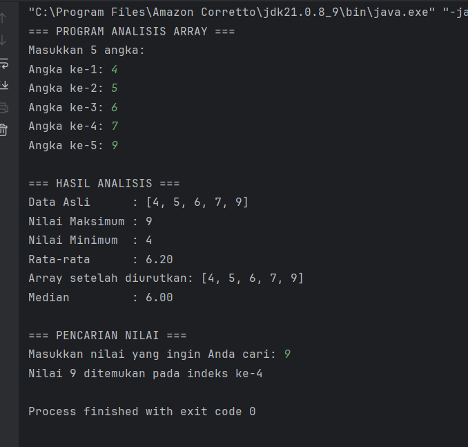

### 3. String dan Manipulasi String
#### Teori Dasar
String adalah tipe data yang menyimpan rangkaian karakter. Di Java, String adalah object yang memiliki banyak method built-in untuk manipulasi teks.

Karakteristik String di Java:
+ String bersifat immutable (tidak dapat diubah)
+ Setiap operasi String menghasilkan String baru
+ Java menyediakan banyak method untuk manipulasi String


Method String yang Penting:

length(): mendapatkan panjang string
charAt(): mendapatkan karakter pada indeks tertentu
substring(): mengambil bagian string
toLowerCase() / toUpperCase(): mengubah case
contains(): mengecek apakah string mengandung substring
replace(): mengganti karakter/substring

### praktikum  3.1: Manipulasi String Dasar
Memahami berbagai method manipulasi string dan penggunaannya.

+ Buat file baru dengan nama StringDasar.java

+ Ketik kode berikut:

``` java
import java.util.Scanner;

public class StringDasar {

    /**
     * Method untuk menampilkan analisis dasar dari sebuah string.
     * Method ini juga memanggil method hitungJumlahKata dan hitungVokal.
     */
    public static void analisisString(String teks) {
        System.out.println("\n--- ANALISIS DASAR ---");
        System.out.println("Teks asli: \"" + teks + "\"");
        System.out.println("Panjang string: " + teks.length());
        System.out.println("Karakter pertama: " + teks.charAt(0));
        System.out.println("Karakter terakhir: " + teks.charAt(teks.length() - 1));
        System.out.println("UPPERCASE: " + teks.toUpperCase());
        System.out.println("lowercase: " + teks.toLowerCase());

        // Menghitung jumlah kata
        int jumlahKata = hitungJumlahKata(teks);
        System.out.println("Jumlah kata: " + jumlahKata);

        // Menghitung jumlah vokal
        int jumlahVokal = hitungVokal(teks);
        System.out.println("Jumlah vokal: " + jumlahVokal);
    }

    /**
     * Method untuk menghitung jumlah kata dalam sebuah string.
     */
    public static int hitungJumlahKata(String teks) {
        // trim() untuk hapus spasi di awal/akhir, split() untuk memecah berdasarkan spasi
        String[] kata = teks.trim().split("\\s+");
        return kata.length;
    }

    /**
     * Method untuk menghitung jumlah huruf vokal dalam sebuah string.
     */
    public static int hitungVokal(String teks) {
        String vokal = "aeiouAEIOU";
        int counter = 0;
        for (int i = 0; i < teks.length(); i++) {
            // Cek apakah karakter saat ini ada di dalam string vokal
            if (vokal.contains(String.valueOf(teks.charAt(i)))) {
                counter++;
            }
        }
        return counter;
    }

    /**
     * Method untuk membalik urutan karakter dalam sebuah string.
     */
    public static String reverseString(String teks) {
        StringBuilder reversed = new StringBuilder();
        for (int i = teks.length() - 1; i >= 0; i--) {
            reversed.append(teks.charAt(i));
        }
        return reversed.toString();
    }

    /**
     * Method untuk mengecek apakah sebuah string adalah palindrom.
     * Palindrom: dibaca sama dari depan maupun belakang (setelah mengabaikan spasi dan simbol).
     */
    public static boolean isPalindrome(String teks) {
        // 1. Bersihkan string dari spasi, simbol, dan ubah ke huruf kecil
        String clean = teks.replaceAll("[^a-zA-Z0-9]", "").toLowerCase();
        // 2. Buat versi terbalik dari string yang sudah bersih
        String reversed = new StringBuilder(clean).reverse().toString();
        // 3. Bandingkan keduanya
        return clean.equals(reversed);
    }

    public static void main(String[] args) {
        Scanner input = new Scanner(System.in);
        System.out.println("=== PROGRAM MANIPULASI STRING ===");
        System.out.print("Masukkan sebuah kalimat: ");
        String kalimat = input.nextLine();

        // Analisis dasar
        analisisString(kalimat);

        // String terbalik
        System.out.println("\nString terbalik: \"" + reverseString(kalimat) + "\"");

        // Cek Palindrom
        if (isPalindrome(kalimat)) {
            System.out.println("String ini adalah palindrom.");
        } else {
            System.out.println("String ini bukan palindrom.");
        }

        // Pencarian substring
        System.out.println("\nMasukkan kata yang ingin dicari:");
        System.out.print("> ");
        String cari = input.nextLine();

        // Cek apakah kata 'cari' ada di dalam 'kalimat' (abaikan huruf besar/kecil)
        if (kalimat.toLowerCase().contains(cari.toLowerCase())) {
            // Cari posisi (indeks) pertama kali kata itu muncul
            int posisi = kalimat.toLowerCase().indexOf(cari.toLowerCase());
            System.out.println("Kata \"" + cari + "\" ditemukan dalam kalimat.");
            System.out.println("Posisi pertama: " + posisi);
        } else {
            System.out.println("Kata \"" + cari + "\" tidak ditemukan dalam kalimat.");
        }
    }
}
```
### menganalisa program dan menginput kalimat palingdrome

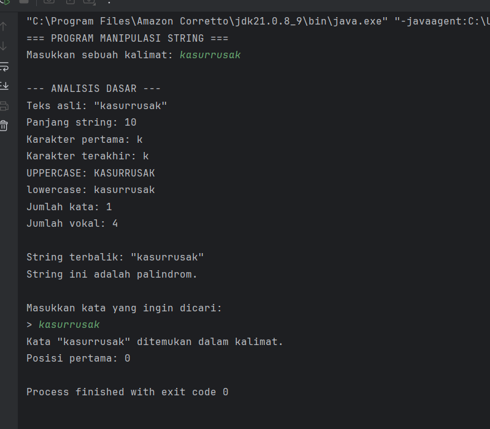

### 1. Bagian "Analisis Dasar"

#### 1. Properti String: Program dengan benar mengidentifikasi properti-properti dasar dari input:

Panjang: 10 karakter.
Karakter Pertama & Terakhir: Keduanya adalah 'k'.
Konversi Huruf: UPPERCASE dan lowercase ditampilkan dengan benar.
Perhitungan:
Jumlah Kata: Dihitung sebagai 1 kata. Ini akurat karena tidak ada spasi dalam input.
Jumlah Vokal: Dihitung 4 huruf vokal (a, u, u, a). Ini juga akurat.

#### 2. Bagian Analisis Lanjutan (Palindrom)
   String Terbalik: Program membalikkan kasurrusak dan hasilnya tetap kasurrusak. Ini adalah demonstrasi visual pertama bahwa input tersebut adalah palindrom.
    Konfirmasi Palindrom: Program kemudian secara eksplisit menyatakan "String ini adalah palindrom.". Ini membuktikan bahwa method isPalindrome() berhasil mengenali input sebagai palindrom, bahkan untuk kasus sederhana ini.

#### 3. Bagian Pencarian Kata
   Input Pencarian: Pengguna mencari kata kasurrusak di dalam kalimat kasurrusak.
    Hasil Pencarian: Program dengan benar menemukan kata tersebut.
    Posisi: Dilaporkan bahwa posisi pertama kata ditemukan adalah 0. Ini akurat, karena dalam pemrograman, indeks (posisi) selalu dimulai dari 0.

### Tugas praktikum 3.1 
Buatkan sebuah class baru dengan nama latihan5.java di dalam package latihan. Selesaikan tugas berikut:
+ Tambahkan fitur untuk menghitung jumlah konsonan
- Buat method untuk mengubah string menjadi pascal case (setiap kata diawali huruf besar)

``` java
package modul_3.Latihan;

import java.util.Scanner;

public class latihan5 {

    public static void analisisString(String teks) {
        System.out.println("\n--- ANALISIS DASAR ---");
        System.out.println("Teks asli: \"" + teks + "\"");
        System.out.println("Panjang string: " + teks.length());
        System.out.println("Karakter pertama: " + teks.charAt(0));
        System.out.println("Karakter terakhir: " + teks.charAt(teks.length() - 1));
        System.out.println("UPPERCASE: " + teks.toUpperCase());
        System.out.println("lowercase: " + teks.toLowerCase());

        // Menghitung jumlah kata
        System.out.println("Jumlah kata: " + hitungJumlahKata(teks));

        // Menghitung jumlah vokal
        System.out.println("Jumlah vokal: " + hitungVokal(teks));

        // [BARU] Menghitung jumlah konsonan
        System.out.println("Jumlah konsonan: " + hitungKonsonan(teks));
    }

    public static int hitungJumlahKata(String teks) {
        String[] kata = teks.trim().split("\\s+");
        return kata.length;
    }

    public static int hitungVokal(String teks) {
        String vokal = "aeiouAEIOU";
        int counter = 0;
        for (int i = 0; i < teks.length(); i++) {
            if (vokal.contains(String.valueOf(teks.charAt(i)))) {
                counter++;
            }
        }
        return counter;
    }

    // =======================================================
    // PENAMBAHAN METHOD BARU DI BAWAH INI
    // =======================================================

    /**
     * [BARU] Method untuk menghitung jumlah huruf konsonan.
     */
    public static int hitungKonsonan(String teks) {
        int jumlahHuruf = 0;
        // Pertama, hitung semua karakter yang merupakan huruf
        for (char ch : teks.toCharArray()) {
            if (Character.isLetter(ch)) {
                jumlahHuruf++;
            }
        }
        // Konsonan = Total Huruf - Total Vokal
        return jumlahHuruf - hitungVokal(teks);
    }

    /**
     * [BARU] Method untuk mengubah string menjadi format Judul (Title Case).
     * Setiap kata diawali huruf besar, sisanya huruf kecil.
     */
    public static String toTitleCase(String teks) {
        if (teks == null || teks.isEmpty()) {
            return "";
        }
        // Pecah kalimat menjadi kata-kata
        String[] kataArray = teks.split("\\s+");
        StringBuilder hasil = new StringBuilder();

        for (String kata : kataArray) {
            if (kata.length() > 0) {
                // Ambil huruf pertama, ubah jadi kapital
                char hurufPertama = Character.toUpperCase(kata.charAt(0));
                // Ambil sisa kata, ubah jadi huruf kecil
                String sisaKata = kata.substring(1).toLowerCase();
                // Gabungkan kembali dan tambahkan spasi
                hasil.append(hurufPertama).append(sisaKata).append(" ");
            }
        }
        // Hilangkan spasi ekstra di akhir
        return hasil.toString().trim();
    }

    // ... (method reverseString dan isPalindrome tetap sama) ...
    public static String reverseString(String teks) {
        StringBuilder reversed = new StringBuilder();
        for (int i = teks.length() - 1; i >= 0; i--) {
            reversed.append(teks.charAt(i));
        }
        return reversed.toString();
    }

    public static boolean isPalindrome(String teks) {
        String clean = teks.replaceAll("[^a-zA-Z0-9]", "").toLowerCase();
        String reversed = new StringBuilder(clean).reverse().toString();
        return clean.equals(reversed);
    }

    public static void main(String[] args) {
        Scanner input = new Scanner(System.in);
        System.out.println("=== PROGRAM MANIPULASI STRING ===");
        System.out.print("Masukkan sebuah kalimat: ");
        String kalimat = input.nextLine();

        // Analisis dasar (sekarang juga menampilkan jumlah konsonan)
        analisisString(kalimat);

        // [BARU] Menampilkan hasil konversi ke Title Case
        System.out.println("\nFormat Judul (Title Case): \"" + toTitleCase(kalimat) + "\"");

        // String terbalik
        System.out.println("String terbalik: \"" + reverseString(kalimat) + "\"");

        // Cek Palindrom
        if (isPalindrome(kalimat)) {
            System.out.println("String ini adalah palindrom.");
        } else {
            System.out.println("String ini bukan palindrom.");
        }

        // Pencarian substring
        System.out.println("\nMasukkan kata yang ingin dicari:");
        System.out.print("> ");
        String cari = input.nextLine();

        if (kalimat.toLowerCase().contains(cari.toLowerCase())) {
            int posisi = kalimat.toLowerCase().indexOf(cari.toLowerCase());
            System.out.println("Kata \"" + cari + "\" ditemukan dalam kalimat.");
            System.out.println("Posisi pertama: " + posisi);
        } else {
            System.out.println("Kata \"" + cari + "\" tidak ditemukan dalam kalimat.");
        }
    }
}
```
### hasil praktikum 3.1
Penjelasan Fitur Baru
#### 1. hitungKonsonan(String teks)

+ Tujuan: Menghitung semua huruf yang bukan vokal.

    Cara Kerja: Method ini bekerja dengan cara yang efisien:

    Pertama, ia menghitung semua karakter yang merupakan huruf (Character.isLetter()).

    Kemudian, ia memanggil method hitungVokal() yang sudah ada.

    Jumlah konsonan didapat dari Total Huruf - Total Vokal.

#### 2. toTitleCase(String teks)

+ Tujuan: Mengubah format string menjadi seperti judul. Istilah standar untuk ini adalah "Title Case". Contoh: selamat PAGI akan menjadi Selamat Pagi.

    Cara Kerja:

    Kalimat dipecah menjadi beberapa kata berdasarkan spasi.

    Setiap kata kemudian diproses: huruf pertamanya diubah menjadi kapital, dan sisa hurufnya diubah menjadi huruf kecil.

    Semua kata yang sudah diformat digabungkan kembali menjadi satu kalimat.

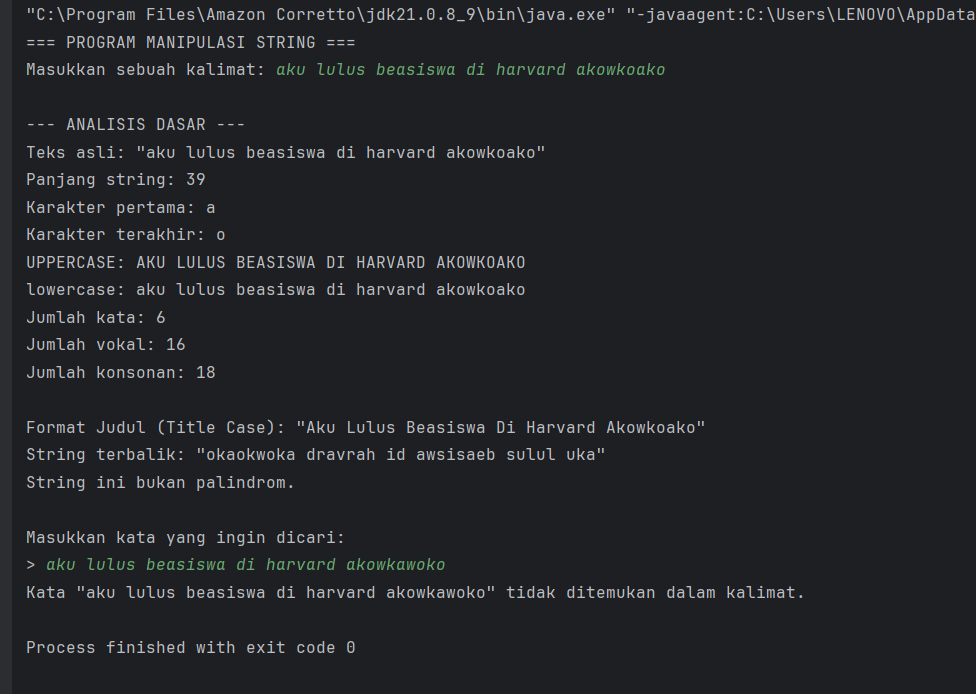

### Praktikum 3.2: Pengolahan Data Text
Memahami penggunaan string untuk pengolahan data dalam format teks.

+ Buat file baru dengan nama TextProcessing.java
+ Ketik kode berikut:

``` java
import java.util.Scanner;

public class TextProcessing {

    /**
     * Method utama untuk memproses dan menganalisis data mahasiswa.
     * Mencari nama terpanjang, terpendek, dan mengurutkan nama.
     */
    public static void prosesDataMahasiswa(String data) {
        // Memisahkan data string menjadi array nama
        String[] dataMahasiswa = data.split(";");
        System.out.println("\n================ ANALISIS DATA ===============");
        System.out.println("Jumlah mahasiswa: " + dataMahasiswa.length);

        // Mencari nama terpanjang dan terpendek
        String namaTerpanjang = dataMahasiswa[0];
        String namaTerpendek = dataMahasiswa[0];
        for (int i = 1; i < dataMahasiswa.length; i++) {
            if (dataMahasiswa[i].length() > namaTerpanjang.length()) {
                namaTerpanjang = dataMahasiswa[i];
            }
            if (dataMahasiswa[i].length() < namaTerpendek.length()) {
                namaTerpendek = dataMahasiswa[i];
            }
        }
        System.out.println("Nama terpanjang: " + namaTerpanjang + " (" + namaTerpanjang.length() + " karakter)");
        System.out.println("Nama terpendek : " + namaTerpendek + " (" + namaTerpendek.length() + " karakter)");

        // Mengurutkan nama mahasiswa secara alfabetis (Bubble Sort)
        for (int i = 0; i < dataMahasiswa.length - 1; i++) {
            for (int j = 0; j < dataMahasiswa.length - i - 1; j++) {
                // compareTo() digunakan untuk membandingkan string
                if (dataMahasiswa[j].compareTo(dataMahasiswa[j + 1]) > 0) {
                    String temp = dataMahasiswa[j];
                    dataMahasiswa[j] = dataMahasiswa[j + 1];
                    dataMahasiswa[j + 1] = temp;
                }
            }
        }

        System.out.println("\nUrutan nama mahasiswa (sesuai abjad):");
        for (int i = 0; i < dataMahasiswa.length; i++) {
            System.out.println((i + 1) + ". " + dataMahasiswa[i]);
        }
    }

    /**
     * Method untuk menampilkan hasil format nama dan username.
     */
    public static void formatNama(String[] nama) {
        System.out.println("\n============== FORMAT NAMA & USERNAME =============");
        for (String namaLengkap : nama) {
            String namaFormatted = formatTitleCase(namaLengkap);
            String username = buatUsername(namaFormatted);
            System.out.println("Nama Lengkap: " + namaFormatted);
            System.out.println("Username    : " + username);
            System.out.println("---");
        }
    }

    /**
     * Method untuk mengubah format teks menjadi Title Case (Setiap Kata Diawali Huruf Besar).
     */
    public static String formatTitleCase(String teks) {
        if (teks == null || teks.isEmpty()) {
            return "";
        }
        String[] kata = teks.split("\\s+");
        StringBuilder hasil = new StringBuilder();
        for (String k : kata) {
            if (k.length() > 0) {
                hasil.append(Character.toUpperCase(k.charAt(0)))
                     .append(k.substring(1).toLowerCase())
                     .append(" ");
            }
        }
        return hasil.toString().trim();
    }

    /**
     * Method untuk membuat username dari nama lengkap.
     * Format: namadepan + hurufpertamanamakedua (jika ada).
     */
    public static String buatUsername(String nama) {
        String[] kata = nama.toLowerCase().split("\\s+");
        if (kata.length == 0) {
            return "";
        }
        StringBuilder username = new StringBuilder(kata[0]);
        if (kata.length > 1) {
            username.append(kata[1].charAt(0));
        }
        return username.toString();
    }

    /**
     * Method untuk membuat password sederhana dari nama.
     * Format: nama dibalik tanpa huruf vokal dan spasi.
     */
    public static String buatPassword(String nama) {
        String reversedName = new StringBuilder(nama).reverse().toString();
        // Regex (?i) membuatnya case-insensitive
        return reversedName.replaceAll("(?i)[aeiou\\s]", "");
    }

    public static void main(String[] args) {
        Scanner input = new Scanner(System.in);
        System.out.println("=== PROGRAM PENGOLAHAN DATA TEKS ===");
        System.out.println("Masukkan nama-nama mahasiswa (pisahkan dengan titik koma ';'):");
        System.out.print("> ");
        String dataInput = input.nextLine();

        // Proses data utama
        prosesDataMahasiswa(dataInput);

        // Format nama
        String[] database = dataInput.split(";");
        formatNama(database);
    }
}
```
### analisa bagaimana program memproses data dan memformat data
#### 1. Input dan Pemisahan Data
+ Input Pengguna: Anda memasukkan zam;abadan;nino;shahroni.

    + Proses split(";"): Method split(";") berhasil menemukan tiga buah titik koma sebagai pemisah. Hasilnya, ia memecah string input menjadi sebuah array dengan 4 elemen:
    + ["zam", "abadan", "nino", "shahroni"]

    + Array inilah yang menjadi dasar untuk semua pemrosesan data selanjutnya.

#### 2. Bagian "Analisis Data" (Method prosesDataMahasiswa)
+ jumlah mahasiswa: 4: Benar. Ini didapat dari panjang array hasil split yang memang berisi 4 elemen.

   + Nama terpanjang: shahroni (8 karakter): Benar. Program melakukan iterasi pada 4 nama tersebut dan membandingkan panjangnya, lalu menemukan "shahroni" (8 huruf) sebagai yang terpanjang.

   + Nama terpendek: zam (3 karakter): Benar. Dengan proses yang sama, "zam" (3 huruf) ditemukan sebagai yang terpendek.

   + Urutan nama mahasiswa (sesuai abjad): Benar. Program menerapkan algoritma pengurutan (Bubble Sort dengan compareTo()) pada array ["zam", "abadan", "nino", "shahroni"]. Hasil pengurutan yang benar secara alfabetis adalah ["abadan", "nino", "shahroni", "zam"]. Output program telah menampilkannya dengan benar dalam format daftar bernomor.

#### 3. Bagian "Format Nama & Username" (Method formatNama)
+ Karena array database sekarang berisi 4 nama, method formatNama melakukan loop sebanyak 4 kali, memproses setiap nama secara individual.

   + Untuk setiap nama (contoh: "abadan"):

   + Nama Lengkap: Method formatTitleCase("abadan") dipanggil. Ia mengubah huruf pertama menjadi kapital dan sisanya menjadi huruf kecil, menghasilkan "Abadan".

   + Username: Method buatUsername("Abadan") dipanggil. Ia mengubah nama menjadi huruf kecil ("abadan"), memecahnya berdasarkan spasi (hanya ada satu kata), dan menggunakannya sebagai username.
  
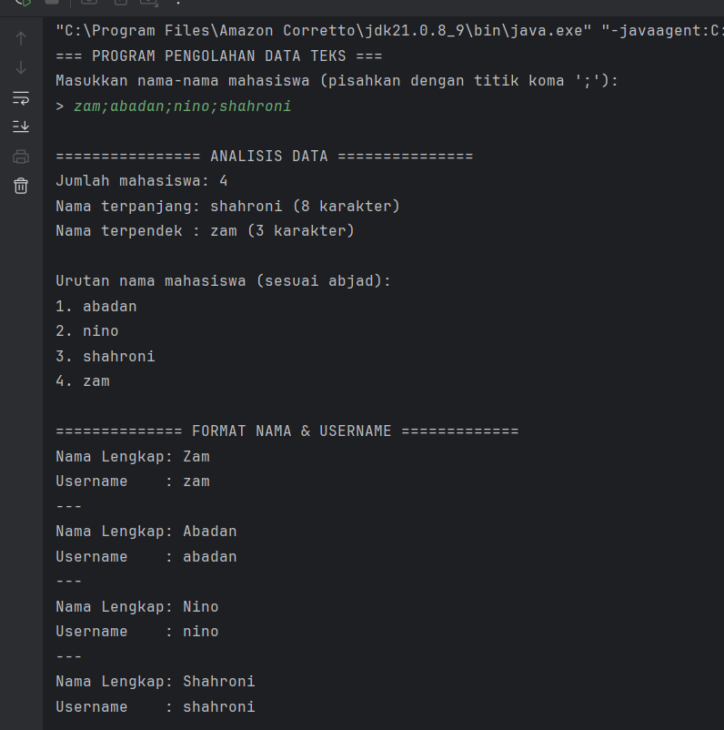

### Tugas praktikum   3.2 
Buatkan sebuah class baru dengan nama latihan4.java di dalam package latihan. Selesaikan tugas berikut:
Dari kode praktikum diatas.
- Tambahkan fitur untuk menghasilkan email address berdasarkan nama
- Buat method untuk memvalidasi format nama (tidak boleh mengandung angka atau karakter khusus)

``` java
package modul_3.Latihan;

import java.util.Scanner;

public class latihan6 {

    public static void prosesDataMahasiswa(String data) {
        String[] dataMahasiswa = data.split(";");
        System.out.println("\n================ ANALISIS DATA ===============");
        System.out.println("Jumlah mahasiswa: " + dataMahasiswa.length);

        // ... (kode di dalam method ini tetap sama) ...
        String namaTerpanjang = dataMahasiswa[0];
        String namaTerpendek = dataMahasiswa[0];
        for (int i = 1; i < dataMahasiswa.length; i++) {
            if (dataMahasiswa[i].length() > namaTerpanjang.length()) {
                namaTerpanjang = dataMahasiswa[i];
            }
            if (dataMahasiswa[i].length() < namaTerpendek.length()) {
                namaTerpendek = dataMahasiswa[i];
            }
        }
        System.out.println("Nama terpanjang: " + namaTerpanjang + " (" + namaTerpanjang.length() + " karakter)");
        System.out.println("Nama terpendek : " + namaTerpendek + " (" + namaTerpendek.length() + " karakter)");

        for (int i = 0; i < dataMahasiswa.length - 1; i++) {
            for (int j = 0; j < dataMahasiswa.length - i - 1; j++) {
                if (dataMahasiswa[j].compareTo(dataMahasiswa[j + 1]) > 0) {
                    String temp = dataMahasiswa[j];
                    dataMahasiswa[j] = dataMahasiswa[j + 1];
                    dataMahasiswa[j + 1] = temp;
                }
            }
        }
        System.out.println("\nUrutan nama mahasiswa (sesuai abjad):");
        for (int i = 0; i < dataMahasiswa.length; i++) {
            System.out.println((i + 1) + ". " + dataMahasiswa[i]);
        }
    }

    public static void formatNama(String[] nama) {
        System.out.println("\n============== FORMAT NAMA, USERNAME & EMAIL =============");
        for (String namaLengkap : nama) {
            String namaFormatted = formatTitleCase(namaLengkap.trim()); // trim() untuk hapus spasi berlebih
            String username = buatUsername(namaFormatted);
            // [BARU] Panggil method untuk membuat email
            String email = buatEmail(namaFormatted);

            System.out.println("Nama Lengkap: " + namaFormatted);
            System.out.println("Username    : " + username);
            System.out.println("Email       : " + email); // Tampilkan email
            System.out.println("---");
        }
    }

    public static String formatTitleCase(String teks) {
        // ... (kode di dalam method ini tetap sama) ...
        if (teks == null || teks.isEmpty()) {
            return "";
        }
        String[] kata = teks.split("\\s+");
        StringBuilder hasil = new StringBuilder();
        for (String k : kata) {
            if (k.length() > 0) {
                hasil.append(Character.toUpperCase(k.charAt(0)))
                        .append(k.substring(1).toLowerCase())
                        .append(" ");
            }
        }
        return hasil.toString().trim();
    }

    public static String buatUsername(String nama) {
        // ... (kode di dalam method ini tetap sama) ...
        String[] kata = nama.toLowerCase().split("\\s+");
        if (kata.length == 0) {
            return "";
        }
        StringBuilder username = new StringBuilder(kata[0]);
        if (kata.length > 1) {
            username.append(kata[1].charAt(0));
        }
        return username.toString();
    }

    public static String buatPassword(String nama) {
        // ... (kode di dalam method ini tetap sama, meskipun tidak dipanggil di main) ...
        String reversedName = new StringBuilder(nama).reverse().toString();
        return reversedName.replaceAll("(?i)[aeiou\\s]", "");
    }

    // =======================================================
    // PENAMBAHAN METHOD BARU DI BAWAH INI
    // =======================================================

    /**
     * [BARU] Method untuk menghasilkan alamat email dari nama.
     * Menggunakan username yang sudah dibuat dan menambahkan domain.
     */
    public static String buatEmail(String nama) {
        String username = buatUsername(nama);
        return username + "@mahasiswa.campus.id";
    }

    /**
     * [BARU] Method untuk memvalidasi format nama.
     * Nama dianggap valid jika hanya mengandung huruf dan spasi.
     */
    public static boolean isNamaValid(String nama) {
        // Regex: ^[a-zA-Z\s]+$
        // Artinya: String harus terdiri dari awal (^) sampai akhir ($)
        // hanya oleh karakter huruf (a-z, A-Z) dan spasi (\s).
        return nama.trim().matches("^[a-zA-Z\\s]+$");
    }

    public static void main(String[] args) {
        Scanner input = new Scanner(System.in);
        System.out.println("=== PROGRAM PENGOLAHAN DATA TEKS ===");
        System.out.println("Masukkan nama-nama mahasiswa (pisahkan dengan titik koma ';'):");
        System.out.print("> ");
        String dataInput = input.nextLine();

        // Memisahkan data input menjadi array
        String[] database = dataInput.split(";");

        // [BARU] Proses validasi input sebelum diproses lebih lanjut
        boolean semuaNamaValid = true;
        for (String nama : database) {
            if (!isNamaValid(nama)) {
                System.out.println("\n[ERROR] Input tidak valid!");
                System.out.println("Nama \"" + nama.trim() + "\" mengandung karakter selain huruf dan spasi.");
                semuaNamaValid = false;
                break; // Hentikan pengecekan jika satu nama sudah tidak valid
            }
        }

        // [BARU] Hanya jalankan proses jika semua nama valid
        if (semuaNamaValid) {
            // Proses data utama
            prosesDataMahasiswa(dataInput);

            // Format nama
            formatNama(database);
        }
    }
}
```
### penjelasam fitur yang ditambah
Penjelasan Fitur Baru
#### 1. Method buatEmail(String nama)

+ Method ini menggunakan kembali buatUsername() untuk mendapatkan dasar alamat email.
+ Kemudian, ia hanya perlu menambahkan domain email yang sudah ditentukan (dalam contoh ini @mahasiswa.campus.id) untuk melengkapi alamat email.

#### 2. Method isNamaValid(String nama)

+ Method ini menggunakan Regular Expression (Regex) untuk melakukan validasi.

+ Pola ^[a-zA-Z\\s]+$ memastikan bahwa string yang diperiksa, dari awal hingga akhir, hanya terdiri dari huruf a-z, A-Z, dan spasi \s.

+ Ia mengembalikan true jika format nama benar, dan false jika mengandung karakter lain (seperti angka atau simbol).

#### 3. Integrasi Validasi di main()

+ Program kini tidak langsung memproses data. Setelah input diterima dan di-split, sebuah loop berjalan untuk memeriksa setiap nama menggunakan isNamaValid().

+ Jika ada satu saja nama yang tidak valid, program akan menampilkan pesan error yang jelas, menghentikan proses, dan tidak akan melanjutkan ke tahap analisis atau format.

+ Proses analisis dan format hanya akan berjalan jika semua nama dalam input dinyatakan valid. Ini membuat program lebih robust (tangguh) terhadap input yang salah.

#### berikut adalah hasil dari output praktikum 3.2

